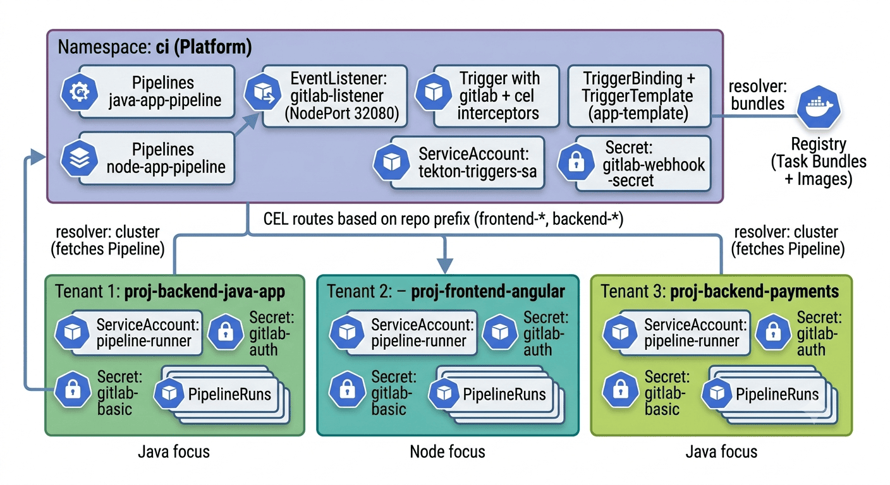

# Multi-tenant com Tekton no k3s — Arquitetura e Playbooks

Documentação da evolução da plataforma Tekton de **single-tenant** (tudo em `ci`) para **multi-tenant com múltiplos stacks** (Pipeline em `ci`, PipelineRuns isolados por projeto), incluindo o playbook detalhado para adicionar novas aplicações e novas stacks.

> Continuação natural do [docs/01-infraestrutura-base.md](01-infraestrutura-base.md). Assume que a infraestrutura base (Tekton + Registry + GitLab + Task Bundles iniciais) está funcionando.

---

## Sumário

1. [Motivação — por que sair do single-tenant](#1-motivação--por-que-sair-do-single-tenant)
2. [Análise dos três padrões possíveis](#2-análise-dos-três-padrões-possíveis)
3. [Arquitetura final escolhida (Padrão B)](#3-arquitetura-final-escolhida-padrão-b)
4. [Convenções de nomeação](#4-convenções-de-nomeação)
5. [Componentes centralizados no ci](#5-componentes-centralizados-no-ci)
6. [Como o EventListener roteia o webhook (CEL)](#6-como-o-eventlistener-roteia-o-webhook-cel)
7. [Fluxo end-to-end](#7-fluxo-end-to-end)
8. [Etapa 1 — Habilitar o cluster resolver](#8-etapa-1--habilitar-o-cluster-resolver)
9. [Etapa 2 — EventListener multi-tenant no ci](#9-etapa-2--eventlistener-multi-tenant-no-ci)
10. [Etapa 3 — Task Bundles compartilhados](#10-etapa-3--task-bundles-compartilhados)
11. [Etapa 4 — Pipelines por stack](#11-etapa-4--pipelines-por-stack)
12. [🎯 PLAYBOOK: Adicionar uma nova aplicação](#12--playbook-adicionar-uma-nova-aplicação)
13. [🎯 PLAYBOOK: Adicionar uma nova stack](#13--playbook-adicionar-uma-nova-stack)
14. [Próximos passos do roadmap](#14-próximos-passos-do-roadmap)

---

## 1. Motivação — por que sair do single-tenant

Na configuração original, **tudo** ficava no namespace `ci`:
- Pipeline `java-app-pipeline`
- Trigger, TriggerBinding, TriggerTemplate, EventListener
- Secrets (webhook, basic-auth git)
- PipelineRuns de qualquer projeto

Isso funciona para um único projeto, mas não escala. Se um segundo time entrar no cluster:
- Enxerga todos os secrets do outro time
- Compartilha as mesmas cotas de recurso
- Não é possível aplicar policies distintas por projeto
- Auditoria vira uma sopa

---

## 2. Análise dos três padrões possíveis

### Padrão A — Todos os PipelineRuns rodam em `ci` (o original)

- ✅ Simples de gerenciar, um único RBAC
- ❌ Isolamento zero, cotas compartilhadas
- **Uso:** lab, PoC, empresa muito pequena

### Padrão B — Pipeline em `ci`, PipelineRuns no namespace do projeto ⭐ (escolhido)

- ✅ Isolamento por projeto (RBAC, cotas, secrets)
- ✅ Reuso do Pipeline como fonte única de verdade
- ✅ Modelo "plataforma como produto"
- ❌ Mais complexo — precisa cluster resolver + roteamento CEL
- **Uso:** múltiplas equipes, ambiente semi-produtivo

### Padrão C — Tudo via Bundles (OCI-only)

- ✅ Máxima portabilidade e versionamento
- ✅ GitOps-friendly
- ❌ Toda alteração de Pipeline vira push de bundle
- **Uso:** produção real, multi-cluster

---

## 3. Arquitetura final escolhida (Padrão B)



---

## 4. Convenções de nomeação

Seguir essas convenções evita 90% dos problemas de roteamento.

| Elemento | Padrão | Exemplo |
|---|---|---|
| **Repo GitLab — Java** | `backend-<nome>` | `backend-payments` |
| **Repo GitLab — Node** | `frontend-<nome>` | `frontend-portal` |
| **Namespace de projeto** | `proj-<nome-do-repo>` | `proj-backend-payments` |
| **ServiceAccount de execução** | `pipeline-runner` (fixo por namespace) | — |
| **Secret de auth Git** | `gitlab-basic-auth` (fixo por namespace) | — |
| **Pipeline no ci — Java** | `java-app-pipeline` | — |
| **Pipeline no ci — Node** | `node-app-pipeline` | — |
| **Imagem no registry** | `apps/<nome-do-repo>:<sha>` | `apps/backend-payments:82a57d1` |

**Por que nomes fixos para SA e Secret:** o `TriggerTemplate` do `ci` referencia esses nomes literalmente ao criar PipelineRuns. Se o nome mudar, a SA usada será `default` (que não tem o secret git) e o clone falha.

**Por que o prefixo `proj-` no namespace:** separa visualmente de namespaces de sistema (`kube-system`) e de infra (`ci`, `registry`). Facilita filtros: `kubectl get ns | grep proj-`.

---

## 5. Componentes centralizados no ci

O namespace `ci` funciona como "produto plataforma":

### 5.1. Pipelines por stack (catálogo de esteiras)

```bash
kubectl -n ci get pipeline
# NAME                 AGE
# java-app-pipeline    ...
# node-app-pipeline    ...
```

Cada Pipeline referencia Task Bundles via `resolver: bundles` do registry interno.

### 5.2. EventListener central

```bash
kubectl -n ci get eventlistener
# NAME              READY
# gitlab-listener   True
```

Exposto via NodePort 32080. **Todos** os webhooks do GitLab apontam para o mesmo endpoint.

### 5.3. RBAC necessário (3 bindings)

| Recurso | Nome | Escopo | Para que serve |
|---|---|---|---|
| RoleBinding | `tekton-triggers-eventlistener-binding` | ns `ci` | EL ler Triggers/Bindings/Templates locais |
| ClusterRoleBinding | `tekton-triggers-sa-cluster` | cluster | EL ler ClusterInterceptors (sem isso → CrashLoopBackOff) |
| ClusterRoleBinding | `tekton-triggers-sa-create-pipelinerun` | cluster | EL criar PipelineRuns em `proj-*` |

### 5.4. Secret do webhook

Um único secret, compartilhado por todos os projetos:
```
gitlab-webhook-secret (namespace: ci)
```

---

## 6. Como o EventListener roteia o webhook (CEL)

Este é o coração da arquitetura multi-tenant.

### Passo 1 — GitLab envia o payload

```json
{
  "object_kind": "push",
  "checkout_sha": "82a57d1...",
  "project": {
    "name": "frontend-angular"
  },
  "repository": {
    "git_http_url": "http://192.168.56.1:8929/root/frontend-angular.git"
  }
}
```

### Passo 2 — Interceptor `gitlab` valida o token

`X-Gitlab-Token` comparado com o secret. Se não bater, evento descartado.

### Passo 3 — Interceptor `cel` calcula o roteamento

```yaml
# Filtro: só processa repos com prefixo conhecido
filter: >-
  body.project.name.startsWith('frontend-') ||
  body.project.name.startsWith('backend-')

# Cálculos (ficam disponíveis como extensions.*)
overlays:
- key: target-namespace
  expression: "'proj-' + body.project.name"
  # → "proj-frontend-angular"

- key: repo-name
  expression: "body.project.name"
  # → "frontend-angular"

- key: pipeline-name
  expression: |
    body.project.name.startsWith('frontend-') ? 'node-app-pipeline' :
    body.project.name.startsWith('backend-')  ? 'java-app-pipeline' :
    'UNKNOWN'
  # → "node-app-pipeline"
```

### Passo 4 — TriggerBinding empacota os parâmetros

```yaml
- name: repo-url         → body.repository.git_http_url
- name: revision         → body.checkout_sha
- name: short-sha        → body.checkout_sha
- name: target-namespace → extensions.target-namespace
- name: repo-name        → extensions.repo-name
- name: pipeline-name    → extensions.pipeline-name
```

### Passo 5 — TriggerTemplate cria o PipelineRun dinamicamente

```yaml
metadata:
  namespace: proj-frontend-angular   # ← dinâmico via tt.params
spec:
  taskRunTemplate:
    serviceAccountName: pipeline-runner   # ← SA do namespace do projeto
  pipelineRef:
    resolver: cluster                     # ← busca Pipeline no ci
    params:
    - { name: name, value: node-app-pipeline }
    - { name: namespace, value: ci }
```

---

## 7. Fluxo end-to-end

```
Developer  ──git push──>  GitLab  ──HTTP POST──>  EventListener (ci)
                                                       │
                                          ┌────────────┴────────────┐
                                          │ gitlab: valida X-Token  │
                                          │ cel: aplica filter      │
                                          │ cel: calcula overlays   │
                                          └────────────┬────────────┘
                                                       │
                                          ┌────────────┴────────────┐
                                          │ TriggerBinding empacota │
                                          │ TriggerTemplate renderiza│
                                          └────────────┬────────────┘
                                                       │ cria PipelineRun
                                                       ▼
                                      PipelineRun em proj-frontend-angular
                                               │
                                               │ cluster resolver
                                               ▼
                                    Pipeline: node-app-pipeline (em ci)
                                               │
                                               │ bundles resolver
                                               ▼
                              Task Bundles (git-clone, node-build, kaniko)
                                               │
                                               │ usa pipeline-runner SA
                                               │ usa gitlab-basic-auth do proj-*
                                               ▼
                                    apps/frontend-angular:<sha>
                                    publicada no registry
```

---

## 8. Etapa 1 — Habilitar o cluster resolver

O cluster resolver permite que PipelineRuns em `proj-*` referenciem Pipelines em `ci`. Sem isso o Padrão B é impossível.

```bash
# Habilitar a feature flag
kubectl -n tekton-pipelines patch cm feature-flags \
  --type merge -p '{"data":{"enable-cluster-resolver":"true"}}'

# Configurar quais namespaces o resolver pode acessar
cat <<'EOF' | kubectl apply -f -
apiVersion: v1
kind: ConfigMap
metadata:
  name: cluster-resolver-config
  namespace: tekton-pipelines-resolvers
data:
  default-namespace: "ci"
  allowed-namespaces: "ci"
EOF
```

`allowed-namespaces: "ci"` significa que qualquer namespace pode buscar Pipelines apenas no `ci` — segurança por design.

**Validação:**
```bash
kubectl -n tekton-pipelines get cm feature-flags \
  -o jsonpath='{.data.enable-cluster-resolver}'
# esperado: true

kubectl get pods -n tekton-pipelines-resolvers
# esperado: tekton-pipelines-remote-resolvers-xxx  1/1  Running
```

---

## 9. Etapa 2 — EventListener multi-tenant no ci

> 📌 Os manifestos desta etapa são explicados aqui passo a passo, mas a versão canônica aplicável vive em [`yaml/ci/`](../yaml/ci/) (`rbac.yaml`, `triggers/gitlab-push-binding.yaml`, `triggers/app-template.yaml`, `triggers/gitlab-push-trigger.yaml`, `triggers/eventlistener.yaml`) e é aplicada de uma vez por [`scripts/setup/04-bootstrap-ci.sh`](../scripts/setup/04-bootstrap-ci.sh) — ver [ADR-001](decisions/ADR-001-padrao-b-multitenant.md) e [ADR-002](decisions/ADR-002-roteamento-cel-prefixo.md).

### 9.1. RBAC completo (3 blocos)

**Bloco 1 — SA + RoleBinding (namespace-local)**
```bash
cat <<'EOF' | kubectl apply -f -
apiVersion: v1
kind: ServiceAccount
metadata:
  name: tekton-triggers-sa
  namespace: ci
---
apiVersion: rbac.authorization.k8s.io/v1
kind: RoleBinding
metadata:
  name: tekton-triggers-eventlistener-binding
  namespace: ci
subjects:
- kind: ServiceAccount
  name: tekton-triggers-sa
  namespace: ci
roleRef:
  apiGroup: rbac.authorization.k8s.io
  kind: ClusterRole
  name: tekton-triggers-eventlistener-roles
EOF
```

**Bloco 2 — ClusterRoleBinding para ClusterInterceptors (sem isso → CrashLoopBackOff)**
```bash
cat <<'EOF' | kubectl apply -f -
apiVersion: rbac.authorization.k8s.io/v1
kind: ClusterRoleBinding
metadata:
  name: tekton-triggers-sa-cluster
subjects:
- kind: ServiceAccount
  name: tekton-triggers-sa
  namespace: ci
roleRef:
  apiGroup: rbac.authorization.k8s.io
  kind: ClusterRole
  name: tekton-triggers-eventlistener-clusterroles
EOF
```

**Bloco 3 — ClusterRoleBinding para criar PipelineRuns cross-namespace**
```bash
cat <<'EOF' | kubectl apply -f -
apiVersion: rbac.authorization.k8s.io/v1
kind: ClusterRole
metadata:
  name: tekton-triggers-create-pipelinerun
rules:
- apiGroups: ["tekton.dev"]
  resources: ["pipelineruns"]
  verbs: ["create", "get", "list", "watch"]
- apiGroups: [""]
  resources: ["serviceaccounts"]
  verbs: ["impersonate"]
---
apiVersion: rbac.authorization.k8s.io/v1
kind: ClusterRoleBinding
metadata:
  name: tekton-triggers-sa-create-pipelinerun
subjects:
- kind: ServiceAccount
  name: tekton-triggers-sa
  namespace: ci
roleRef:
  apiGroup: rbac.authorization.k8s.io
  kind: ClusterRole
  name: tekton-triggers-create-pipelinerun
EOF
```

### 9.2. Secret do webhook

```bash
TOKEN=$(openssl rand -hex 20)
echo "GUARDE ESTE TOKEN: $TOKEN"

kubectl -n ci create secret generic gitlab-webhook-secret \
  --from-literal=secretToken="$TOKEN"
```

### 9.3. TriggerBinding

```bash
cat <<'EOF' | kubectl apply -f -
apiVersion: triggers.tekton.dev/v1beta1
kind: TriggerBinding
metadata:
  name: gitlab-push-binding
  namespace: ci
spec:
  params:
  - name: repo-url
    value: $(body.repository.git_http_url)
  - name: revision
    value: $(body.checkout_sha)
  - name: short-sha
    value: $(body.checkout_sha)
  - name: target-namespace
    value: $(extensions.target-namespace)
  - name: repo-name
    value: $(extensions.repo-name)
  - name: pipeline-name
    value: $(extensions.pipeline-name)
EOF
```

### 9.4. TriggerTemplate

```bash
cat <<'EOF' | kubectl apply -f -
apiVersion: triggers.tekton.dev/v1beta1
kind: TriggerTemplate
metadata:
  name: app-template
  namespace: ci
spec:
  params:
  - name: repo-url
  - name: revision
  - name: short-sha
  - name: target-namespace
  - name: repo-name
  - name: pipeline-name
  resourcetemplates:
  - apiVersion: tekton.dev/v1
    kind: PipelineRun
    metadata:
      generateName: $(tt.params.repo-name)-run-
      namespace: $(tt.params.target-namespace)
    spec:
      taskRunTemplate:
        serviceAccountName: pipeline-runner
      pipelineRef:
        resolver: cluster
        params:
        - { name: kind, value: pipeline }
        - { name: name, value: $(tt.params.pipeline-name) }
        - { name: namespace, value: ci }
      params:
      - { name: repo-url, value: $(tt.params.repo-url) }
      - { name: revision, value: $(tt.params.revision) }
      - name: image
        value: registry.registry.svc.cluster.local:5000/apps/$(tt.params.repo-name):$(tt.params.short-sha)
      workspaces:
      - name: shared
        volumeClaimTemplate:
          spec:
            accessModes: ["ReadWriteOnce"]
            resources:
              requests:
                storage: 2Gi
EOF
```

### 9.5. Trigger com dois interceptors (gitlab + cel)

```bash
cat <<'EOF' | kubectl apply -f -
apiVersion: triggers.tekton.dev/v1beta1
kind: Trigger
metadata:
  name: gitlab-push-trigger
  namespace: ci
spec:
  serviceAccountName: tekton-triggers-sa
  interceptors:
  - ref:
      name: "gitlab"
    params:
    - name: secretRef
      value:
        secretName: gitlab-webhook-secret
        secretKey: secretToken
    - name: eventTypes
      value: ["Push Hook"]
  - ref:
      name: "cel"
    params:
    - name: filter
      value: >-
        body.project.name.startsWith('frontend-') ||
        body.project.name.startsWith('backend-')
    - name: overlays
      value:
      - key: target-namespace
        expression: "'proj-' + body.project.name"
      - key: repo-name
        expression: "body.project.name"
      - key: pipeline-name
        expression: |
          body.project.name.startsWith('frontend-') ? 'node-app-pipeline' :
          body.project.name.startsWith('backend-')  ? 'java-app-pipeline' :
          'UNKNOWN'
  bindings:
  - ref: gitlab-push-binding
  template:
    ref: app-template
EOF
```

### 9.6. EventListener + NodePort

```bash
cat <<'EOF' | kubectl apply -f -
apiVersion: triggers.tekton.dev/v1beta1
kind: EventListener
metadata:
  name: gitlab-listener
  namespace: ci
spec:
  serviceAccountName: tekton-triggers-sa
  triggers:
  - triggerRef: gitlab-push-trigger
---
apiVersion: v1
kind: Service
metadata:
  name: el-gitlab-listener-np
  namespace: ci
spec:
  type: NodePort
  selector:
    eventlistener: gitlab-listener
  ports:
  - port: 8080
    targetPort: 8080
    nodePort: 32080
EOF
```

**Após qualquer mudança em Trigger/Binding/Template, reiniciar o pod do EL:**
```bash
kubectl -n ci delete pod -l eventlistener=gitlab-listener
```

**Validação final:**
```bash
kubectl -n ci get eventlistener,svc,pods
# Esperado:
# - eventlistener/gitlab-listener  READY=True
# - service/el-gitlab-listener     ClusterIP (criado automaticamente)
# - service/el-gitlab-listener-np  NodePort 32080
# - pod/el-gitlab-listener-xxx     1/1 Running
```

---

## 10. Etapa 3 — Task Bundles compartilhados

Task Bundles ficam no registry e são reutilizados por qualquer Pipeline — adicionar uma nova app não requer criar novos bundles.

> 📌 Fonte das Tasks: [`yaml/tasks/`](../yaml/tasks/). Publicação automatizada em [`scripts/setup/05-publish-task-bundles.sh`](../scripts/setup/05-publish-task-bundles.sh) (nunca sobrescreve tag em uso — [ADR-003](decisions/ADR-003-task-bundles-versionados.md)).

### 10.1. Catálogo atual

```bash
curl -s http://192.168.56.110:32000/v2/_catalog
```

| Bundle | Função |
|---|---|
| `tekton/git-clone:v1` | Clone + checkout |
| `tekton/maven-build:v1` | `mvn clean package` |
| `tekton/node-build:v1` | `npm install` + `npm run build` |
| `tekton/kaniko-build-push:v1` | Build e push de imagem |

### 10.2. Task `node-build` (versão validada)

Esta é a versão que passou nos testes — evita os problemas comuns com `$(comando)` e `npm ci`:

```yaml
apiVersion: tekton.dev/v1
kind: Task
metadata:
  name: node-build
spec:
  description: Instala dependências e compila uma aplicação Node.js.
  params:
  - name: node-version
    type: string
    default: "20"
  - name: build-command
    type: string
    default: "npm run build"
  - name: install-command
    type: string
    default: "npm install"     # npm install, não npm ci (evita exigir package-lock.json)
  workspaces:
  - name: source
  steps:
  - name: install
    image: node:$(params.node-version)-alpine
    workingDir: $(workspaces.source.path)
    script: |
      #!/bin/sh
      set -eu
      $(params.install-command)
  - name: build
    image: node:$(params.node-version)-alpine
    workingDir: $(workspaces.source.path)
    script: |
      #!/bin/sh
      set -eu
      $(params.build-command)
      ls -lh dist/ 2>/dev/null || echo "dist nao encontrado"
```

```bash
tkn bundle push 192.168.56.110:32000/tekton/node-build:v1 -f tasks/node-build.yaml
```

---

## 11. Etapa 4 — Pipelines por stack

> 📌 Fonte canônica: [`yaml/ci/pipelines/`](../yaml/ci/pipelines/).

### 11.1. java-app-pipeline

```bash
cat <<'EOF' | kubectl apply -f -
apiVersion: tekton.dev/v1
kind: Pipeline
metadata:
  name: java-app-pipeline
  namespace: ci
spec:
  params:
  - { name: repo-url, type: string }
  - { name: revision, type: string, default: main }
  - { name: image, type: string }
  workspaces:
  - name: shared
  tasks:
  - name: clone
    taskRef:
      resolver: bundles
      params:
      - { name: bundle, value: "registry.registry.svc.cluster.local:5000/tekton/git-clone:v1" }
      - { name: name, value: git-clone }
      - { name: kind, value: task }
    params:
    - { name: url, value: "$(params.repo-url)" }
    - { name: revision, value: "$(params.revision)" }
    workspaces:
    - { name: output, workspace: shared }
  - name: build
    runAfter: [clone]
    taskRef:
      resolver: bundles
      params:
      - { name: bundle, value: "registry.registry.svc.cluster.local:5000/tekton/maven-build:v1" }
      - { name: name, value: maven-build }
      - { name: kind, value: task }
    workspaces:
    - { name: source, workspace: shared }
  - name: image
    runAfter: [build]
    taskRef:
      resolver: bundles
      params:
      - { name: bundle, value: "registry.registry.svc.cluster.local:5000/tekton/kaniko-build-push:v1" }
      - { name: name, value: kaniko-build-push }
      - { name: kind, value: task }
    params:
    - { name: image, value: "$(params.image)" }
    workspaces:
    - { name: source, workspace: shared }
EOF
```

### 11.2. node-app-pipeline

```bash
cat <<'EOF' | kubectl apply -f -
apiVersion: tekton.dev/v1
kind: Pipeline
metadata:
  name: node-app-pipeline
  namespace: ci
spec:
  params:
  - { name: repo-url, type: string }
  - { name: revision, type: string, default: main }
  - { name: image, type: string }
  - { name: node-version, type: string, default: "20" }
  workspaces:
  - name: shared
  tasks:
  - name: clone
    taskRef:
      resolver: bundles
      params:
      - { name: bundle, value: "registry.registry.svc.cluster.local:5000/tekton/git-clone:v1" }
      - { name: name, value: git-clone }
      - { name: kind, value: task }
    params:
    - { name: url, value: "$(params.repo-url)" }
    - { name: revision, value: "$(params.revision)" }
    workspaces:
    - { name: output, workspace: shared }
  - name: build
    runAfter: [clone]
    taskRef:
      resolver: bundles
      params:
      - { name: bundle, value: "registry.registry.svc.cluster.local:5000/tekton/node-build:v1" }
      - { name: name, value: node-build }
      - { name: kind, value: task }
    params:
    - { name: install-command, value: "npm install" }
    workspaces:
    - { name: source, workspace: shared }
  - name: image
    runAfter: [build]
    taskRef:
      resolver: bundles
      params:
      - { name: bundle, value: "registry.registry.svc.cluster.local:5000/tekton/kaniko-build-push:v1" }
      - { name: name, value: kaniko-build-push }
      - { name: kind, value: task }
    params:
    - { name: image, value: "$(params.image)" }
    workspaces:
    - { name: source, workspace: shared }
EOF
```

**Validação:**
```bash
kubectl -n ci get pipeline
# NAME               AGE
# java-app-pipeline  ...
# node-app-pipeline  ...
```

---

## 12. 🎯 PLAYBOOK: Adicionar uma nova aplicação

Esta é a seção central: o procedimento repetível para colocar qualquer nova app na plataforma. Usando `backend-payments` (Java) como exemplo.

### Passo 1 — Escolher o nome do repo seguindo a convenção

| Stack | Prefixo obrigatório | Exemplo |
|---|---|---|
| Java/Maven | `backend-` | `backend-payments` |
| Node/Angular/React | `frontend-` | `frontend-portal` |

O CEL do Trigger lê `body.project.name` e decide qual Pipeline aplicar pelo prefixo. Sem prefixo correto, o evento é descartado e nada roda.

---

### Passo 2 — Criar o projeto no GitLab

1. Canto superior direito **+ → New project → Create blank project**
2. **Project name:** `backend-payments`
3. **Visibility Level:** `Internal`
4. **Initialize repository with a README:** desmarcar
5. **Create project**

Anote a URL do repo: `http://192.168.56.1:8929/root/backend-payments.git`

---

### Passo 3 — Gerar um PAT dedicado

O PAT é a credencial que a Task `git-clone` usará para baixar o código.

1. Avatar → **Preferences → Access tokens → Add new token**
2. **Name:** `tekton-proj-backend-payments`
3. **Expiration:** em branco (lab)
4. **Scopes:** marcar `read_repository`
5. **Create personal access token**
6. **⚠️ Copie imediatamente** — só aparece uma vez

PAT dedicado por projeto: se vazar, revoga apenas aquele, sem afetar os outros.

---

### Passo 4 — Provisionar o namespace do projeto

```bash
# Namespace com labels para queries futuras
kubectl create ns proj-backend-payments
kubectl label ns proj-backend-payments \
  tekton.dev/project=true \
  app=backend-payments

# Secret com o PAT
kubectl -n proj-backend-payments create secret generic gitlab-basic-auth \
  --type=kubernetes.io/basic-auth \
  --from-literal=username=root \
  --from-literal=password='<PAT>'

# Anotar: "use esse secret quando clonar dessa URL"
kubectl -n proj-backend-payments annotate secret gitlab-basic-auth \
  tekton.dev/git-0=http://192.168.56.1:8929

# ServiceAccount pipeline-runner com o secret
cat <<'EOF' | kubectl apply -f -
apiVersion: v1
kind: ServiceAccount
metadata:
  name: pipeline-runner
  namespace: proj-backend-payments
secrets:
- name: gitlab-basic-auth
EOF
```

**Validação:**
```bash
kubectl -n proj-backend-payments get sa,secret
# deve mostrar: pipeline-runner, default, gitlab-basic-auth
```

---

### Passo 5 — Cadastrar o webhook no GitLab

Obter o token:
```bash
kubectl -n ci get secret gitlab-webhook-secret \
  -o jsonpath='{.data.secretToken}' | base64 -d && echo
```

No projeto GitLab → **Settings → Webhooks → Add new webhook**:

| Campo | Valor |
|---|---|
| URL | `http://192.168.56.110:32080` |
| Secret Token | valor obtido acima |
| Trigger | ✓ Push events |
| Enable SSL verification | ☐ desmarcar |

**Teste:** botão **Test → Push events** → resposta esperada: `HTTP 202`.

---

### Passo 6 — Fazer push do código

O repo precisa ter um **`Dockerfile` na raiz** — sem ele, o Kaniko não tem o que buildar.

**Para Java (`backend-*`):**

```
backend-payments/
├── pom.xml
├── Dockerfile
└── src/main/java/...
```

```dockerfile
FROM eclipse-temurin:17-jre-alpine
WORKDIR /app
COPY target/*.jar app.jar
ENTRYPOINT ["java", "-jar", "app.jar"]
```

**Para Node (`frontend-*`):**

```
frontend-portal/
├── package.json
├── src/
├── nginx.conf
└── Dockerfile
```

```dockerfile
FROM node:20-alpine AS builder
WORKDIR /app
COPY package*.json ./
RUN npm install
COPY . .
RUN npm run build

FROM nginx:1.27-alpine
COPY --from=builder /app/dist/frontend-portal/ /usr/share/nginx/html/
COPY nginx.conf /etc/nginx/conf.d/default.conf
EXPOSE 80
```

```bash
cd backend-payments
git init
git add .
git commit -m "Initial commit"
git remote add origin http://192.168.56.1:8929/root/backend-payments.git
git push -u origin main
```

O push dispara o webhook → pipeline começa automaticamente.

---

### Acompanhar a execução

```bash
# Terminal 1 — log do EL (ver o CEL calculando o roteamento)
kubectl -n ci logs -l eventlistener=gitlab-listener -f --timestamps

# Terminal 2 — status do run
kubectl -n proj-backend-payments get pipelinerun -w

# Terminal 3 — log do pipeline (após o run aparecer)
tkn pipelinerun logs -f -n proj-backend-payments --last

# Verificar imagem publicada
curl -s http://192.168.56.110:32000/v2/apps/backend-payments/tags/list
```

---

### Checklist rápido

```
[ ] Repo com prefixo backend- ou frontend-
[ ] PAT gerado (scope: read_repository)
[ ] kubectl create ns proj-<repo>
[ ] Secret gitlab-basic-auth + anotação tekton.dev/git-0
[ ] ServiceAccount pipeline-runner + secret anexado
[ ] Webhook cadastrado no GitLab (URL + token)
[ ] Dockerfile na raiz do repo
[ ] git push
```

Tempo estimado: ~5 minutos por app.

---

## 13. 🎯 PLAYBOOK: Adicionar uma nova stack

Cenário: hoje suporta Java e Node; você quer adicionar Python.

### Passo 1 — Criar a Task da nova stack

```bash
cat > tasks/pip-build.yaml <<'EOF'
apiVersion: tekton.dev/v1
kind: Task
metadata:
  name: pip-build
spec:
  description: Instala dependências Python.
  params:
  - name: python-version
    type: string
    default: "3.12"
  workspaces:
  - name: source
  steps:
  - name: install
    image: python:$(params.python-version)-alpine
    workingDir: $(workspaces.source.path)
    script: |
      #!/bin/sh
      set -eu
      pip install --no-cache-dir -r requirements.txt
      python -m compileall .
EOF

tkn bundle push 192.168.56.110:32000/tekton/pip-build:v1 -f tasks/pip-build.yaml
```

### Passo 2 — Criar o Pipeline

```bash
cat <<'EOF' | kubectl apply -f -
apiVersion: tekton.dev/v1
kind: Pipeline
metadata:
  name: python-app-pipeline
  namespace: ci
spec:
  params:
  - { name: repo-url, type: string }
  - { name: revision, type: string, default: main }
  - { name: image, type: string }
  workspaces:
  - name: shared
  tasks:
  - name: clone
    taskRef:
      resolver: bundles
      params:
      - { name: bundle, value: "registry.registry.svc.cluster.local:5000/tekton/git-clone:v1" }
      - { name: name, value: git-clone }
      - { name: kind, value: task }
    params:
    - { name: url, value: "$(params.repo-url)" }
    - { name: revision, value: "$(params.revision)" }
    workspaces:
    - { name: output, workspace: shared }
  - name: build
    runAfter: [clone]
    taskRef:
      resolver: bundles
      params:
      - { name: bundle, value: "registry.registry.svc.cluster.local:5000/tekton/pip-build:v1" }
      - { name: name, value: pip-build }
      - { name: kind, value: task }
    workspaces:
    - { name: source, workspace: shared }
  - name: image
    runAfter: [build]
    taskRef:
      resolver: bundles
      params:
      - { name: bundle, value: "registry.registry.svc.cluster.local:5000/tekton/kaniko-build-push:v1" }
      - { name: name, value: kaniko-build-push }
      - { name: kind, value: task }
    params:
    - { name: image, value: "$(params.image)" }
    workspaces:
    - { name: source, workspace: shared }
EOF
```

### Passo 3 — Atualizar o CEL do Trigger

Adicionar o novo prefixo no `filter` e no `overlays.pipeline-name`:

```bash
# Editar o Trigger e incluir:
#
# filter:
#   ... || body.project.name.startsWith('python-')
#
# overlays.pipeline-name:
#   body.project.name.startsWith('python-') ? 'python-app-pipeline' : ...

kubectl -n ci edit trigger gitlab-push-trigger
```

### Passo 4 — Reiniciar o EL

```bash
kubectl -n ci delete pod -l eventlistener=gitlab-listener
kubectl -n ci get pods -l eventlistener=gitlab-listener -w
```

Espere `1/1 Running`. A partir daí, repos com prefixo `python-` roteiam para `python-app-pipeline`.

---

## 14. Próximos passos do roadmap

Com o Padrão B validado:

1. **Testes** — Task `maven-test` antes do build, JaCoCo para coverage
2. **CD com ArgoCD** — repo GitOps + Applications sincronizando manifests
3. **Segurança** — Trivy scan na imagem, Cosign para assinatura
4. **Observabilidade** — Prometheus + Grafana + Loki
5. **Promoção entre ambientes** — dev → staging → prod via MR

Cada etapa se encaixa sem quebrar o que existe: os namespaces `proj-<app>` continuam sendo os pontos de isolamento por projeto.

---

## Referências

- [Tekton Cluster Resolver](https://tekton.dev/docs/pipelines/cluster-resolver/)
- [Tekton CEL Interceptor](https://tekton.dev/docs/triggers/cel_expressions/)
- [Tekton Auth for Git](https://tekton.dev/docs/pipelines/auth/#configuring-basic-auth-authentication-for-git)
- [Kubernetes RBAC](https://kubernetes.io/docs/reference/access-authn-authz/rbac/)
