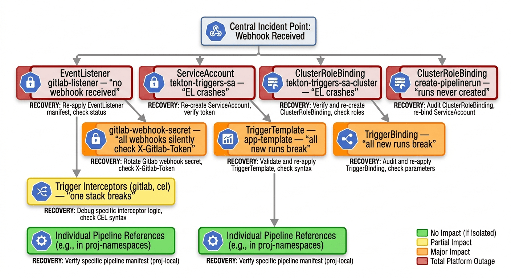
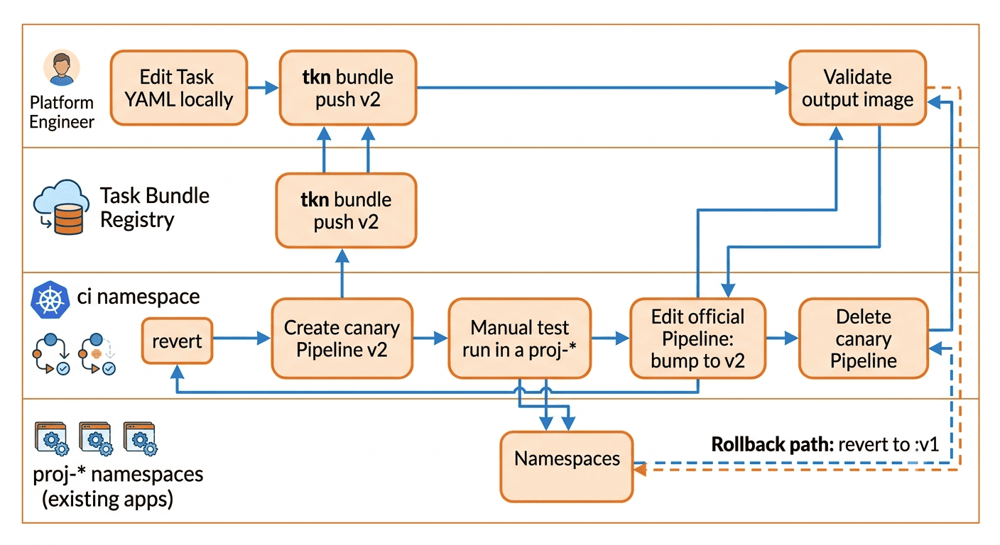

# Playbook Operacional do Namespace `ci` — a Plataforma Tekton

Guia passo a passo para **montar, entender, manter e recuperar** o namespace `ci`, que concentra toda a plataforma de CI/CD do cluster.

> Complemento ao [docs/02-arquitetura-multitenant.md](02-arquitetura-multitenant.md). Enquanto aquele foca em **arquitetura e onboarding**, este documento é sobre a **operação da plataforma em si**.
> Para troubleshooting consolidado, consulte [docs/05-troubleshooting.md](05-troubleshooting.md).
> Para diagramas, consulte [docs/06-diagramas-prompts.md](06-diagramas-prompts.md).

---

## Sumário

1. [O que é o namespace `ci` (e o que não é)](#1-o-que-é-o-namespace-ci-e-o-que-não-é)
2. [Inventário completo dos recursos](#2-inventário-completo-dos-recursos)
3. [Mapa mental: quem depende de quem](#3-mapa-mental-quem-depende-de-quem)
4. [🎯 PLAYBOOK: Montar o `ci` do zero](#4--playbook-montar-o-ci-do-zero)
5. [🎯 PLAYBOOK: Adicionar suporte a uma nova stack](#5--playbook-adicionar-suporte-a-uma-nova-stack)
6. [🎯 PLAYBOOK: Atualizar uma Task existente](#6--playbook-atualizar-uma-task-existente)
7. [🎯 PLAYBOOK: Rotacionar o token do webhook](#7--playbook-rotacionar-o-token-do-webhook)
8. [🎯 PLAYBOOK: Recuperar o `ci` após incidente](#8--playbook-recuperar-o-ci-após-incidente)
9. [Comandos de diagnóstico rápido](#9-comandos-de-diagnóstico-rápido)

---

## 1. O que é o namespace `ci` (e o que não é)

### É

- A **plataforma** de CI/CD do cluster
- O ponto único de entrada de webhooks (via `EventListener`)
- O **catálogo de Pipelines** disponíveis (um por stack)
- O ponto de decisão de roteamento (CEL define para qual namespace o run vai)

### Não é

- ❌ Lugar onde `PipelineRun` de aplicação roda (esses vão para `proj-*`)
- ❌ Lugar onde secrets de aplicação moram (esses vão para `proj-*`)
- ❌ Namespace de desenvolvedores (só a equipe de plataforma toca aqui)

### Princípio de operação

> Mudança no `ci` afeta **todos** os projetos. Mudança em `proj-*` afeta **apenas aquele projeto**.

Isso significa: tratar mudanças no `ci` como **mudanças de infraestrutura**. Testar antes, comunicar antes, ter rollback pronto.

---

## 2. Inventário completo dos recursos

Este é o inventário de tudo que deve existir em `ci`. Se algo aqui não existir, algo está quebrado.

### 2.1. ServiceAccount

| Nome | Propósito |
|---|---|
| `tekton-triggers-sa` | Usada pelo pod do EventListener para validar interceptors, consultar Triggers e criar PipelineRuns em outros namespaces |

### 2.2. Secret

| Nome | Tipo | Propósito |
|---|---|---|
| `gitlab-webhook-secret` | Opaque | Token compartilhado entre GitLab e o interceptor `gitlab`. **Um só para todos os projetos** |

### 2.3. RBAC

| Recurso | Nome | Escopo | Propósito |
|---|---|---|---|
| RoleBinding | `tekton-triggers-eventlistener-binding` | ns `ci` | Permite ao EL ler Triggers/Bindings/Templates locais |
| ClusterRoleBinding | `tekton-triggers-sa-cluster` | cluster | Permite ler ClusterInterceptors e ClusterTriggerBindings |
| ClusterRoleBinding | `tekton-triggers-sa-create-pipelinerun` | cluster | Permite CRIAR PipelineRuns em qualquer namespace |
| ClusterRole customizada | `tekton-triggers-create-pipelinerun` | cluster | Define os verbos permitidos (create/get/list/watch pipelineruns + impersonate serviceaccounts) |

### 2.4. Pipelines (um por stack)

| Nome | Stack | Tasks referenciadas |
|---|---|---|
| `java-app-pipeline` | Java + Maven | git-clone → maven-build → kaniko-build-push |
| `node-app-pipeline` | Node + Angular | git-clone → node-build → kaniko-build-push |

### 2.5. Recursos do Triggers

| Recurso | Nome | Propósito |
|---|---|---|
| Trigger | `gitlab-push-trigger` | Combina interceptors (gitlab + cel), binding e template |
| TriggerBinding | `gitlab-push-binding` | Extrai dados do payload + overlays do CEL para params nomeados |
| TriggerTemplate | `app-template` | Renderiza o PipelineRun no namespace calculado, com SA correta |
| EventListener | `gitlab-listener` | Pod HTTP que recebe os webhooks |
| Service | `el-gitlab-listener` | ClusterIP criado automaticamente pelo EL |
| Service | `el-gitlab-listener-np` | NodePort 32080 (exposição externa criada manualmente) |

### 2.6. Task Bundles (não moram no `ci`, mas são consumidos por ele)

Ficam no registry interno (`registry.registry.svc.cluster.local:5000/tekton/*:v1`) mas são referenciados pelos Pipelines do `ci`:

- `tekton/git-clone:v1`
- `tekton/maven-build:v1`
- `tekton/node-build:v1`
- `tekton/kaniko-build-push:v1`

---

## 3. Mapa mental: quem depende de quem

Antes de mexer em qualquer coisa, entenda a cadeia de dependências:






### O que quebra se…

| Você mudar | O que quebra |
|---|---|
| `gitlab-webhook-secret` | Todos os webhooks passam a retornar 202 mas o interceptor gitlab rejeita silenciosamente. Você tem que reconfigurar o token em cada webhook do GitLab |
| CRB `tekton-triggers-sa-create-pipelinerun` | Webhooks chegam, mas nenhum PipelineRun é criado em `proj-*` (log do EL mostra `forbidden`) |
| `app-template` | Todos os projetos param — nenhum novo PipelineRun é renderizado corretamente |
| Um `Pipeline` (java/node) | Só os projetos daquela stack param |
| Um Task Bundle (`v1`) e sobrescreve | **TODOS** os PipelineRuns futuros (em curso e novos) usam a nova versão. Sem rollback fácil |

**Regra de ouro:** ao versionar Task Bundles, use tags novas (`v2`, `v3`) e migre os Pipelines conscientemente. Nunca sobrescreva `v1` em uso.

---

## 4. 🎯 PLAYBOOK: Montar o `ci` do zero

Cenário: cluster limpo, Tekton já instalado, Task Bundles já publicados. Você vai montar a plataforma inteira.

> 🔧 **Playbook** — os passos 1 a 7 abaixo estão automatizados em [`scripts/setup/04-bootstrap-ci.sh`](../scripts/setup/04-bootstrap-ci.sh) (idempotente, aplica os manifestos canônicos em [`yaml/ci/`](../yaml/ci/)). Use o script no dia a dia; a explicação passo a passo abaixo continua valendo para entender **por quê** cada peça existe e para recuperação manual quando algo quebra parcialmente.

### Passo 1 — Criar o namespace

```bash
kubectl create ns ci
kubectl label ns ci tekton.dev/role=platform
```

**Por quê:** label ajuda em queries futuras (`kubectl get ns -l tekton.dev/role=platform`) e comunica visualmente que este namespace tem um papel especial.

---

### Passo 2 — Habilitar cluster resolver

Sem isso, PipelineRuns em `proj-*` não enxergam Pipelines em `ci`.

```bash
# Feature flag
kubectl -n tekton-pipelines patch cm feature-flags \
  --type merge -p '{"data":{"enable-cluster-resolver":"true"}}'

# Configurar quais namespaces podem acessar (só ci)
cat <<'EOF' | kubectl apply -f -
apiVersion: v1
kind: ConfigMap
metadata:
  name: cluster-resolver-config
  namespace: tekton-pipelines-resolvers
data:
  default-namespace: "ci"
  allowed-namespaces: "ci"
EOF
```

**Validação:**
```bash
kubectl -n tekton-pipelines get cm feature-flags \
  -o jsonpath='{.data.enable-cluster-resolver}'
# esperado: true
```

---

### Passo 3 — RBAC completo do EL

Três blocos, cada um com propósito distinto.

**3.1. ServiceAccount + RoleBinding (namespace-local)**

```bash
cat <<'EOF' | kubectl apply -f -
apiVersion: v1
kind: ServiceAccount
metadata:
  name: tekton-triggers-sa
  namespace: ci
---
apiVersion: rbac.authorization.k8s.io/v1
kind: RoleBinding
metadata:
  name: tekton-triggers-eventlistener-binding
  namespace: ci
subjects:
- kind: ServiceAccount
  name: tekton-triggers-sa
  namespace: ci
roleRef:
  apiGroup: rbac.authorization.k8s.io
  kind: ClusterRole
  name: tekton-triggers-eventlistener-roles
EOF
```

**3.2. ClusterRoleBinding para recursos cluster-scoped**

Este é o famoso "sem ele o EL entra em CrashLoopBackOff":

```bash
cat <<'EOF' | kubectl apply -f -
apiVersion: rbac.authorization.k8s.io/v1
kind: ClusterRoleBinding
metadata:
  name: tekton-triggers-sa-cluster
subjects:
- kind: ServiceAccount
  name: tekton-triggers-sa
  namespace: ci
roleRef:
  apiGroup: rbac.authorization.k8s.io
  kind: ClusterRole
  name: tekton-triggers-eventlistener-clusterroles
EOF
```

**Por quê:** o EL precisa listar `ClusterInterceptor` e `ClusterTriggerBinding` para funcionar. Sem essa permissão, o pod não passa nem do startup.

**3.3. ClusterRoleBinding para criar PipelineRuns cross-namespace**

```bash
cat <<'EOF' | kubectl apply -f -
apiVersion: rbac.authorization.k8s.io/v1
kind: ClusterRole
metadata:
  name: tekton-triggers-create-pipelinerun
rules:
- apiGroups: ["tekton.dev"]
  resources: ["pipelineruns"]
  verbs: ["create", "get", "list", "watch"]
- apiGroups: [""]
  resources: ["serviceaccounts"]
  verbs: ["impersonate"]
---
apiVersion: rbac.authorization.k8s.io/v1
kind: ClusterRoleBinding
metadata:
  name: tekton-triggers-sa-create-pipelinerun
subjects:
- kind: ServiceAccount
  name: tekton-triggers-sa
  namespace: ci
roleRef:
  apiGroup: rbac.authorization.k8s.io
  kind: ClusterRole
  name: tekton-triggers-create-pipelinerun
EOF
```

**Por quê:** o TriggerTemplate cria PipelineRuns em `proj-<repo>`. Sem essa permissão, o EL retorna 202 pro GitLab mas o Triggers controller não consegue criar o recurso.

---

### Passo 4 — Secret do webhook

Escolha um token forte (32+ caracteres, aleatório):

```bash
# Gera um token aleatório de 40 caracteres
TOKEN=$(openssl rand -hex 20)
echo "GUARDE ESTE TOKEN: $TOKEN"

kubectl -n ci create secret generic gitlab-webhook-secret \
  --from-literal=secretToken="$TOKEN"
```

**⚠️ Guarde o token em local seguro.** Você vai precisar dele para cadastrar cada webhook no GitLab.

**Validação:**
```bash
kubectl -n ci get secret gitlab-webhook-secret -o jsonpath='{.data.secretToken}' | base64 -d
echo
# deve retornar o token que você guardou
```

---

### Passo 5 — Pipelines por stack

Aqui você registra os "templates de esteira" que serão reutilizados pelas apps.

**5.1. Pipeline Java**

```bash
cat <<'EOF' | kubectl apply -f -
apiVersion: tekton.dev/v1
kind: Pipeline
metadata:
  name: java-app-pipeline
  namespace: ci
spec:
  params:
  - name: repo-url
    type: string
  - name: revision
    type: string
    default: main
  - name: image
    type: string
  workspaces:
  - name: shared
  tasks:
  - name: clone
    taskRef:
      resolver: bundles
      params:
      - { name: bundle, value: "registry.registry.svc.cluster.local:5000/tekton/git-clone:v1" }
      - { name: name, value: git-clone }
      - { name: kind, value: task }
    params:
    - { name: url, value: "$(params.repo-url)" }
    - { name: revision, value: "$(params.revision)" }
    workspaces:
    - { name: output, workspace: shared }
  - name: build
    runAfter: [clone]
    taskRef:
      resolver: bundles
      params:
      - { name: bundle, value: "registry.registry.svc.cluster.local:5000/tekton/maven-build:v1" }
      - { name: name, value: maven-build }
      - { name: kind, value: task }
    workspaces:
    - { name: source, workspace: shared }
  - name: image
    runAfter: [build]
    taskRef:
      resolver: bundles
      params:
      - { name: bundle, value: "registry.registry.svc.cluster.local:5000/tekton/kaniko-build-push:v1" }
      - { name: name, value: kaniko-build-push }
      - { name: kind, value: task }
    params:
    - { name: image, value: "$(params.image)" }
    workspaces:
    - { name: source, workspace: shared }
EOF
```

**5.2. Pipeline Node**

```bash
cat <<'EOF' | kubectl apply -f -
apiVersion: tekton.dev/v1
kind: Pipeline
metadata:
  name: node-app-pipeline
  namespace: ci
spec:
  params:
  - name: repo-url
    type: string
  - name: revision
    type: string
    default: main
  - name: image
    type: string
  - name: node-version
    type: string
    default: "20"
  workspaces:
  - name: shared
  tasks:
  - name: clone
    taskRef:
      resolver: bundles
      params:
      - { name: bundle, value: "registry.registry.svc.cluster.local:5000/tekton/git-clone:v1" }
      - { name: name, value: git-clone }
      - { name: kind, value: task }
    params:
    - { name: url, value: "$(params.repo-url)" }
    - { name: revision, value: "$(params.revision)" }
    workspaces:
    - { name: output, workspace: shared }
  - name: build
    runAfter: [clone]
    taskRef:
      resolver: bundles
      params:
      - { name: bundle, value: "registry.registry.svc.cluster.local:5000/tekton/node-build:v1" }
      - { name: name, value: node-build }
      - { name: kind, value: task }
    params:
    - { name: node-version, value: "$(params.node-version)" }
    - { name: install-command, value: "npm install" }
    workspaces:
    - { name: source, workspace: shared }
  - name: image
    runAfter: [build]
    taskRef:
      resolver: bundles
      params:
      - { name: bundle, value: "registry.registry.svc.cluster.local:5000/tekton/kaniko-build-push:v1" }
      - { name: name, value: kaniko-build-push }
      - { name: kind, value: task }
    params:
    - { name: image, value: "$(params.image)" }
    workspaces:
    - { name: source, workspace: shared }
EOF
```

**Validação:**
```bash
kubectl -n ci get pipeline
# esperado: java-app-pipeline e node-app-pipeline
```

---

### Passo 6 — Triggers (Binding, Template, Trigger)

Ordem importa: `Binding` e `Template` devem existir antes do `Trigger` que os referencia.

**6.1. TriggerBinding**

```bash
cat <<'EOF' | kubectl apply -f -
apiVersion: triggers.tekton.dev/v1beta1
kind: TriggerBinding
metadata:
  name: gitlab-push-binding
  namespace: ci
spec:
  params:
  - name: repo-url
    value: $(body.repository.git_http_url)
  - name: revision
    value: $(body.checkout_sha)
  - name: short-sha
    value: $(body.checkout_sha)
  - name: target-namespace
    value: $(extensions.target-namespace)
  - name: repo-name
    value: $(extensions.repo-name)
  - name: pipeline-name
    value: $(extensions.pipeline-name)
EOF
```

**6.2. TriggerTemplate**

```bash
cat <<'EOF' | kubectl apply -f -
apiVersion: triggers.tekton.dev/v1beta1
kind: TriggerTemplate
metadata:
  name: app-template
  namespace: ci
spec:
  params:
  - name: repo-url
  - name: revision
  - name: short-sha
  - name: target-namespace
  - name: repo-name
  - name: pipeline-name
  resourcetemplates:
  - apiVersion: tekton.dev/v1
    kind: PipelineRun
    metadata:
      generateName: $(tt.params.repo-name)-run-
      namespace: $(tt.params.target-namespace)
    spec:
      taskRunTemplate:
        serviceAccountName: pipeline-runner
      pipelineRef:
        resolver: cluster
        params:
        - { name: kind, value: pipeline }
        - { name: name, value: $(tt.params.pipeline-name) }
        - { name: namespace, value: ci }
      params:
      - { name: repo-url, value: $(tt.params.repo-url) }
      - { name: revision, value: $(tt.params.revision) }
      - { name: image, value: "registry.registry.svc.cluster.local:5000/apps/$(tt.params.repo-name):$(tt.params.short-sha)" }
      workspaces:
      - name: shared
        volumeClaimTemplate:
          spec:
            accessModes: ["ReadWriteOnce"]
            resources:
              requests:
                storage: 2Gi
EOF
```

**6.3. Trigger (o coração do roteamento)**

```bash
cat <<'EOF' | kubectl apply -f -
apiVersion: triggers.tekton.dev/v1beta1
kind: Trigger
metadata:
  name: gitlab-push-trigger
  namespace: ci
spec:
  serviceAccountName: tekton-triggers-sa
  interceptors:
  - ref:
      name: "gitlab"
    params:
    - name: secretRef
      value:
        secretName: gitlab-webhook-secret
        secretKey: secretToken
    - name: eventTypes
      value: ["Push Hook"]
  - ref:
      name: "cel"
    params:
    - name: filter
      value: >-
        body.project.name.startsWith('frontend-') ||
        body.project.name.startsWith('backend-')
    - name: overlays
      value:
      - key: target-namespace
        expression: "'proj-' + body.project.name"
      - key: repo-name
        expression: "body.project.name"
      - key: pipeline-name
        expression: |
          body.project.name.startsWith('frontend-') ? 'node-app-pipeline' :
          body.project.name.startsWith('backend-')  ? 'java-app-pipeline' :
          'UNKNOWN'
  bindings:
  - ref: gitlab-push-binding
  template:
    ref: app-template
EOF
```

---

### Passo 7 — EventListener + NodePort

```bash
cat <<'EOF' | kubectl apply -f -
apiVersion: triggers.tekton.dev/v1beta1
kind: EventListener
metadata:
  name: gitlab-listener
  namespace: ci
spec:
  serviceAccountName: tekton-triggers-sa
  triggers:
  - triggerRef: gitlab-push-trigger
---
apiVersion: v1
kind: Service
metadata:
  name: el-gitlab-listener-np
  namespace: ci
spec:
  type: NodePort
  selector:
    eventlistener: gitlab-listener
  ports:
  - port: 8080
    targetPort: 8080
    nodePort: 32080
EOF
```

**Validação:**
```bash
kubectl -n ci get eventlistener,svc,pods
```

Esperado:
- `eventlistener/gitlab-listener` com `READY=True`
- `service/el-gitlab-listener` (criado pelo controller)
- `service/el-gitlab-listener-np` (criado por você)
- `pod/el-gitlab-listener-xxx` com `1/1 Running`

---

### Passo 8 — Smoke test

```bash
# Do server, simular um POST com o token correto:
TOKEN=$(kubectl -n ci get secret gitlab-webhook-secret -o jsonpath='{.data.secretToken}' | base64 -d)

kubectl -n ci run curl-test --rm -i --restart=Never --image=curlimages/curl:latest -- \
  curl -v -X POST \
  -H "Content-Type: application/json" \
  -H "X-Gitlab-Event: Push Hook" \
  -H "X-Gitlab-Token: $TOKEN" \
  -d '{"object_kind":"push","checkout_sha":"test1234","project":{"name":"backend-example"},"repository":{"git_http_url":"http://example/repo.git"}}' \
  http://el-gitlab-listener.ci.svc.cluster.local:8080
```

**Esperado:** HTTP 202 e resposta JSON com `eventListener`, `eventID`.

Se você tem um namespace `proj-backend-example` existente com `pipeline-runner` configurado, o pipeline vai rodar (e provavelmente falhar no clone porque o repo é fake, mas isso já valida que o roteamento funciona).

---

### ✅ Checklist final

```
[ ] Namespace ci criado com label
[ ] Cluster resolver habilitado
[ ] ServiceAccount tekton-triggers-sa criada
[ ] RoleBinding local aplicado
[ ] ClusterRoleBinding para eventlistener-clusterroles aplicado
[ ] ClusterRole + ClusterRoleBinding para create-pipelinerun aplicado
[ ] Secret gitlab-webhook-secret criado
[ ] Pipeline java-app-pipeline aplicado
[ ] Pipeline node-app-pipeline aplicado
[ ] TriggerBinding gitlab-push-binding aplicado
[ ] TriggerTemplate app-template aplicado
[ ] Trigger gitlab-push-trigger aplicado
[ ] EventListener gitlab-listener aplicado
[ ] Service NodePort 32080 aplicado
[ ] Pod do EL 1/1 Running
[ ] Smoke test com curl retornou 202
```

---

## 5. 🎯 PLAYBOOK: Adicionar suporte a uma nova stack

Cenário: hoje suporta Java e Node; você quer adicionar Python (Django/Flask).

### Passo 1 — Criar a Task específica da stack (se necessário)

Se já existir Task genérica que serve, pule. Para Python, criar `pip-build`:

```bash
cd ~/tekton-lab

cat > tasks/pip-build.yaml <<'EOF'
apiVersion: tekton.dev/v1
kind: Task
metadata:
  name: pip-build
spec:
  description: Instala dependências Python.
  params:
  - name: python-version
    type: string
    default: "3.12"
  workspaces:
  - name: source
  steps:
  - name: install
    image: python:$(params.python-version)-alpine
    workingDir: $(workspaces.source.path)
    script: |
      #!/bin/sh
      set -eu
      pip install --no-cache-dir -r requirements.txt
      python -m compileall .
EOF

tkn bundle push 192.168.56.110:32000/tekton/pip-build:v1 -f tasks/pip-build.yaml
```

---

### Passo 2 — Criar o Pipeline

```bash
cat <<'EOF' | kubectl apply -f -
apiVersion: tekton.dev/v1
kind: Pipeline
metadata:
  name: python-app-pipeline
  namespace: ci
spec:
  params:
  - { name: repo-url, type: string }
  - { name: revision, type: string, default: main }
  - { name: image, type: string }
  workspaces:
  - name: shared
  tasks:
  - name: clone
    taskRef:
      resolver: bundles
      params:
      - { name: bundle, value: "registry.registry.svc.cluster.local:5000/tekton/git-clone:v1" }
      - { name: name, value: git-clone }
      - { name: kind, value: task }
    params:
    - { name: url, value: "$(params.repo-url)" }
    - { name: revision, value: "$(params.revision)" }
    workspaces:
    - { name: output, workspace: shared }
  - name: build
    runAfter: [clone]
    taskRef:
      resolver: bundles
      params:
      - { name: bundle, value: "registry.registry.svc.cluster.local:5000/tekton/pip-build:v1" }
      - { name: name, value: pip-build }
      - { name: kind, value: task }
    workspaces:
    - { name: source, workspace: shared }
  - name: image
    runAfter: [build]
    taskRef:
      resolver: bundles
      params:
      - { name: bundle, value: "registry.registry.svc.cluster.local:5000/tekton/kaniko-build-push:v1" }
      - { name: name, value: kaniko-build-push }
      - { name: kind, value: task }
    params:
    - { name: image, value: "$(params.image)" }
    workspaces:
    - { name: source, workspace: shared }
EOF
```

---

### Passo 3 — Atualizar o CEL do Trigger

Adicionar o novo prefixo tanto no `filter` quanto no `overlays.pipeline-name`:

```bash
cat <<'EOF' | kubectl apply -f -
apiVersion: triggers.tekton.dev/v1beta1
kind: Trigger
metadata:
  name: gitlab-push-trigger
  namespace: ci
spec:
  serviceAccountName: tekton-triggers-sa
  interceptors:
  - ref:
      name: "gitlab"
    params:
    - name: secretRef
      value:
        secretName: gitlab-webhook-secret
        secretKey: secretToken
    - name: eventTypes
      value: ["Push Hook"]
  - ref:
      name: "cel"
    params:
    - name: filter
      value: >-
        body.project.name.startsWith('frontend-') ||
        body.project.name.startsWith('backend-') ||
        body.project.name.startsWith('python-')
    - name: overlays
      value:
      - key: target-namespace
        expression: "'proj-' + body.project.name"
      - key: repo-name
        expression: "body.project.name"
      - key: pipeline-name
        expression: |
          body.project.name.startsWith('frontend-') ? 'node-app-pipeline' :
          body.project.name.startsWith('backend-')  ? 'java-app-pipeline' :
          body.project.name.startsWith('python-')   ? 'python-app-pipeline' :
          'UNKNOWN'
  bindings:
  - ref: gitlab-push-binding
  template:
    ref: app-template
EOF
```

---

### Passo 4 — Reiniciar o EL para recarregar o Trigger

```bash
kubectl -n ci delete pod -l eventlistener=gitlab-listener
kubectl -n ci get pods -l eventlistener=gitlab-listener -w
```

Espere `1/1 Running`.

---

### Passo 5 — Validar com um repo teste

Criar repo `python-hello` no GitLab, seguir o playbook de nova app do documento anterior. Push, deve rotear pro `python-app-pipeline`.

---

## 6. 🎯 PLAYBOOK: Atualizar uma Task existente

Cenário: você melhorou a Task `maven-build` (novo parâmetro, imagem base atualizada). Como atualizar sem quebrar quem está usando?

> A partir do Épico 3/4 (`charts/tekton-bundles` e `charts/tekton-platform`), o caminho **recomendado** é via Helm — ver §6a logo abaixo. O playbook `kubectl`/`tkn` manual (§6b) continua funcionando e documenta o que os charts fazem por baixo.

### Regra: **NUNCA sobrescreva um Task Bundle em uso**

O Tekton faz cache dos bundles pelo digest. Se você sobrescrever `v1`:
- PipelineRuns em execução podem usar a versão antiga em cache
- Novos runs baixam a nova versão sem aviso
- Não há como fazer rollback rápido

### 6a. Via Helm (recomendado — HLM-16)

Usa `charts/tekton-bundles` para publicar a nova tag e `charts/tekton-platform` para migrar o Pipeline, mantendo a mesma disciplina do ADR-003 (nunca sobrescrever tag em uso) — só que a mudança agora fica em `values.yaml`, versionada e revertível com `helm upgrade` em vez de `kubectl edit` ad-hoc. Comandos abaixo usam `alpine/helm:3.14.4` via Docker (`helm` não está instalado no host deste lab, ver `charts/*/values.yaml`).

#### Passo 1 — Publicar a nova tag do bundle

Edite `bundles.mavenBuild.tag` (e `.image`, se a imagem base também mudou) em `charts/tekton-bundles/values.yaml` (ou passe via `--set`) e faça upgrade:

```bash
docker run --rm -v "$PWD":/data -w /data -v ~/.kube:/root/.kube \
  alpine/helm:3.14.4 upgrade tekton-bundles ./charts/tekton-bundles \
  --set bundles.mavenBuild.tag=v2
```

O Job `pre-install,pre-upgrade` é idempotente: publica `maven-build:v2` só se a tag ainda não existir no registry (checa `/v2/tekton/maven-build/tags/list`) e nunca toca em `v1`.

#### Passo 2 — Testar em uma stack "canary"

Em vez de copiar o Pipeline manualmente, adicione uma entrada temporária em `platform.stacks` (em `charts/tekton-platform/values.yaml` ou via `--set`) apontando pra tag nova — isso gera um Pipeline `java-app-v2-pipeline` sem tocar no `java-app-pipeline` oficial:

```bash
docker run --rm -v "$PWD":/data -w /data -v ~/.kube:/root/.kube \
  alpine/helm:3.14.4 upgrade tekton-platform ./charts/tekton-platform \
  --set 'platform.stacks[2].name=java-app-v2' \
  --set 'platform.stacks[2].repoPrefix=backend-canary-' \
  --set 'platform.stacks[2].buildTask.name=maven-build' \
  --set 'platform.stacks[2].buildTask.tag=v2'
```

> `--set` em lista sobrescreve o array inteiro a partir do índice informado — mais seguro editar um `values-canary.yaml` temporário com os dois stacks (o original + o canário) e passar `-f`. Testar disparando um push num repo `backend-canary-*` de teste.

#### Passo 3 — Migrar o Pipeline oficial

Validado o canário, troque a tag na stack real e faça o upgrade — isso re-renderiza `java-app-pipeline` com `maven-build:v2`:

```bash
docker run --rm -v "$PWD":/data -w /data -v ~/.kube:/root/.kube \
  alpine/helm:3.14.4 upgrade tekton-platform ./charts/tekton-platform \
  --set 'platform.stacks[0].buildTask.tag=v2'
```

Persista a mudança em `charts/tekton-platform/values.yaml` (commitar) para não perdê-la no próximo `helm upgrade` de outra pessoa.

#### Passo 4 — Remover a stack canária

Apague a entrada temporária de `platform.stacks` e faça upgrade de novo — o Pipeline `java-app-v2-pipeline` é removido junto (Helm reconcilia o que não está mais no values).

#### Se algo der errado — rollback

```bash
# Reverte só o Pipeline (Task Bundle v1 nunca foi apagado do registry)
docker run --rm -v "$PWD":/data -w /data -v ~/.kube:/root/.kube \
  alpine/helm:3.14.4 upgrade tekton-platform ./charts/tekton-platform \
  --set 'platform.stacks[0].buildTask.tag=v1'

# Ou volta pro release Helm anterior inteiro
helm rollback tekton-platform
```

Rollback em segundos — mesmo valor do versionamento explícito do ADR-003, agora com histórico de releases do Helm como bônus.

---

### 6b. Via kubectl/tkn (manual)

O que os charts do §6a fazem por baixo, comando a comando.

#### Passo 1 — Publicar como nova tag

```bash
cd ~/tekton-lab

# Editar o arquivo local
vim tasks/maven-build.yaml

# Publicar com nova versão
tkn bundle push 192.168.56.110:32000/tekton/maven-build:v2 -f tasks/maven-build.yaml
```

#### Passo 2 — Testar em um Pipeline "canary"

Criar Pipeline temporário `java-app-pipeline-v2` que usa `maven-build:v2`. Testar com uma app específica antes de migrar todas.

```bash
# Copiar o Pipeline atual e mudar só a referência do bundle
kubectl -n ci get pipeline java-app-pipeline -o yaml > /tmp/java-v2.yaml

# Editar o arquivo:
# - metadata.name: java-app-pipeline-v2
# - trocar tekton/maven-build:v1 por tekton/maven-build:v2

kubectl apply -f /tmp/java-v2.yaml
```

Testar disparando um run manualmente contra esse Pipeline. Se der certo, seguir.

#### Passo 3 — Migrar o Pipeline oficial

Só depois do canary validado:

```bash
# Editar o Pipeline oficial
kubectl -n ci edit pipeline java-app-pipeline
# Trocar tekton/maven-build:v1 por tekton/maven-build:v2
```

#### Passo 4 — Deletar o canary

```bash
kubectl -n ci delete pipeline java-app-pipeline-v2
```

#### Se algo der errado — rollback

```bash
kubectl -n ci edit pipeline java-app-pipeline
# Trocar tekton/maven-build:v2 de volta para :v1
```

Rollback em segundos. Isso é o valor do versionamento explícito.

---

## 7. 🎯 PLAYBOOK: Rotacionar o token do webhook

Cenário: o token do secret pode ter vazado (log público, screenshot compartilhado). Você precisa trocar sem parar a plataforma.

> 🔧 **Playbook** — passos 1 a 3 automatizados em [`scripts/ops/rotate-webhook-token.sh`](../scripts/ops/rotate-webhook-token.sh). Os passos 4 e 5 (atualizar cada webhook no GitLab e validar) continuam manuais de propósito.

### Passo 1 — Gerar novo token

```bash
NEW_TOKEN=$(openssl rand -hex 20)
echo "NOVO TOKEN: $NEW_TOKEN"
```

### Passo 2 — Atualizar o secret

```bash
kubectl -n ci create secret generic gitlab-webhook-secret \
  --from-literal=secretToken="$NEW_TOKEN" \
  --dry-run=client -o yaml | kubectl apply -f -
```

**Nota:** o `--dry-run=client -o yaml | apply` é o padrão para "atualizar" um secret (o `kubectl create secret` puro falha se já existe).

### Passo 3 — Reiniciar o EL para carregar o novo token

```bash
kubectl -n ci delete pod -l eventlistener=gitlab-listener
```

### Passo 4 — Atualizar TODOS os webhooks no GitLab

**Neste momento os webhooks vão começar a retornar erro** (o token antigo não bate mais). Você precisa correr atualizar cada projeto.

Na UI do GitLab, para cada projeto:
- **Settings → Webhooks → Edit**
- Colar o novo token no campo Secret Token
- **Save changes**

### Passo 5 — Validar

Fazer um push de teste em cada projeto e ver os PipelineRuns nascendo.

---

## 8. 🎯 PLAYBOOK: Recuperar o `ci` após incidente

Cenário: alguém deletou o namespace `ci` por engano. Ou o cluster reiniciou e algo se corrompeu.

### Diagnóstico rápido — o que está quebrado?

```bash
# 1. Namespace existe?
kubectl get ns ci

# 2. Recursos essenciais existem?
kubectl -n ci get pipeline,trigger,triggerbinding,triggertemplate,eventlistener,sa,secret

# 3. EL está rodando?
kubectl -n ci get pods

# 4. Cluster resolver está ok?
kubectl -n tekton-pipelines get cm feature-flags -o jsonpath='{.data.enable-cluster-resolver}'

# 5. Interceptors registrados?
kubectl get clusterinterceptors
```

### Cenário A — Namespace deletado inteiro

Seguir o [Playbook de montar o ci do zero](#4--playbook-montar-o-ci-do-zero). **⚠️ Todos os webhooks vão continuar apontando pra 192.168.56.110:32080**, então assim que o novo EL subir, tudo volta a funcionar. Você só perde o histórico de PipelineRuns antigos que estavam em `ci` (os que estão em `proj-*` sobrevivem).

### Cenário B — EL em CrashLoopBackOff

```bash
kubectl -n ci logs -l eventlistener=gitlab-listener --tail=30
```

Erros comuns e correções:

| Erro no log | Solução |
|---|---|
| `clusterinterceptors ... forbidden` | Reaplicar o CRB `tekton-triggers-sa-cluster` |
| `pipelineruns ... forbidden` | Reaplicar o CRB `tekton-triggers-sa-create-pipelinerun` |
| `secret ... not found` | Recriar `gitlab-webhook-secret` |
| `unable to sync configmap` | Reiniciar o pod: `kubectl -n ci delete pod -l eventlistener=gitlab-listener` |

### Cenário C — Webhook chega mas nada acontece

Fluxo de diagnóstico:

```bash
# 1. O evento chegou? (log em tempo real)
kubectl -n ci logs -l eventlistener=gitlab-listener -f

# 2. Simular um webhook interno
TOKEN=$(kubectl -n ci get secret gitlab-webhook-secret -o jsonpath='{.data.secretToken}' | base64 -d)
kubectl -n ci run diag --rm -i --restart=Never --image=curlimages/curl:latest -- \
  curl -X POST \
  -H "Content-Type: application/json" \
  -H "X-Gitlab-Event: Push Hook" \
  -H "X-Gitlab-Token: $TOKEN" \
  -d '{"object_kind":"push","checkout_sha":"test","project":{"name":"backend-diag"},"repository":{"git_http_url":"http://x/x.git"}}' \
  http://el-gitlab-listener.ci.svc.cluster.local:8080

# 3. Verificar se o PipelineRun foi tentado
kubectl get pipelinerun -A --sort-by=.metadata.creationTimestamp | tail -5
```

Se o `curl` interno funciona mas o do GitLab não → problema é o webhook (URL, token, rede). Se nem o interno funciona → problema é no EL/Triggers.

---

## 9. Comandos de diagnóstico rápido

> 🔧 **Playbook** — cada um destes comandos já existe como script em [`scripts/ops/`](../scripts/ops/): [`diagnose-el.sh`](../scripts/ops/diagnose-el.sh) (status + describe + logs + eventos em um único output, cobre também o Cenário B/C acima), [`show-webhook-token.sh`](../scripts/ops/show-webhook-token.sh), [`list-all-runs.sh`](../scripts/ops/list-all-runs.sh) e [`restart-el.sh`](../scripts/ops/restart-el.sh). Os aliases abaixo continuam úteis para quem prefere digitar menos no dia a dia.

Cole em um `.bashrc` alias para acesso rápido:

```bash
# Status geral do ci
alias ci-status='kubectl -n ci get pipeline,trigger,triggerbinding,triggertemplate,eventlistener,sa,secret,pods'

# Log do EL em tempo real
alias ci-log='kubectl -n ci logs -l eventlistener=gitlab-listener -f --timestamps'

# Últimos runs em todos os namespaces
alias ci-runs='kubectl get pipelinerun -A --sort-by=.metadata.creationTimestamp | tail -20'

# Ver o token do webhook
alias ci-token='kubectl -n ci get secret gitlab-webhook-secret -o jsonpath="{.data.secretToken}" | base64 -d && echo'

# Reiniciar o EL
alias ci-restart-el='kubectl -n ci delete pod -l eventlistener=gitlab-listener'
```

Para carregar sem sair do terminal:
```bash
source ~/.bashrc
```

---

## 10. Diagramas e referências

- Prompts para gerar diagramas: [docs/06-diagramas-prompts.md](06-diagramas-prompts.md)

---

## Referências

- [Tekton Triggers docs](https://tekton.dev/docs/triggers/)
- [Tekton Cluster Resolver](https://tekton.dev/docs/pipelines/cluster-resolver/)
- [Tekton Bundles Resolver](https://tekton.dev/docs/pipelines/bundle-resolver/)
- [CEL Language Definition](https://github.com/google/cel-spec/blob/master/doc/langdef.md)
- [Kubernetes RBAC Good Practices](https://kubernetes.io/docs/concepts/security/rbac-good-practices/)

