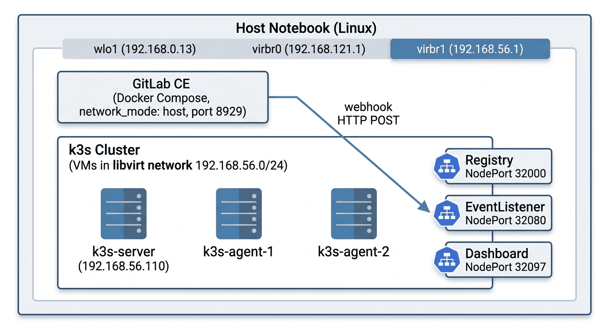
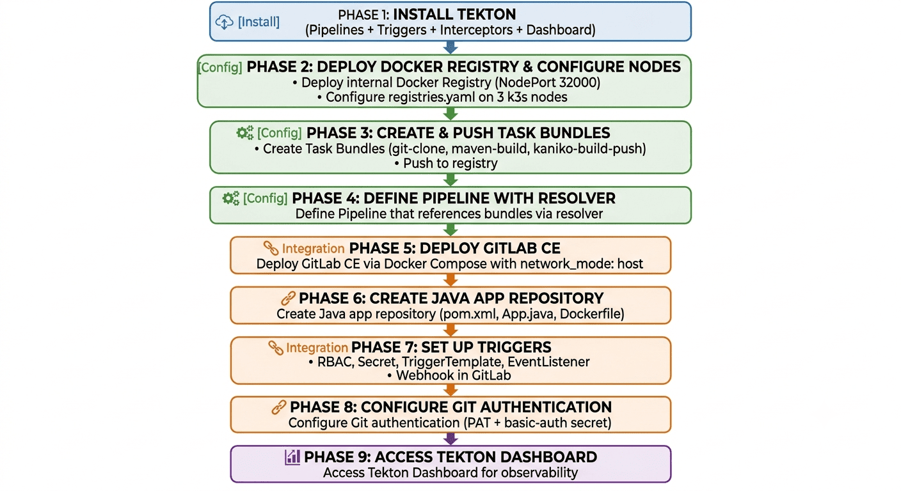
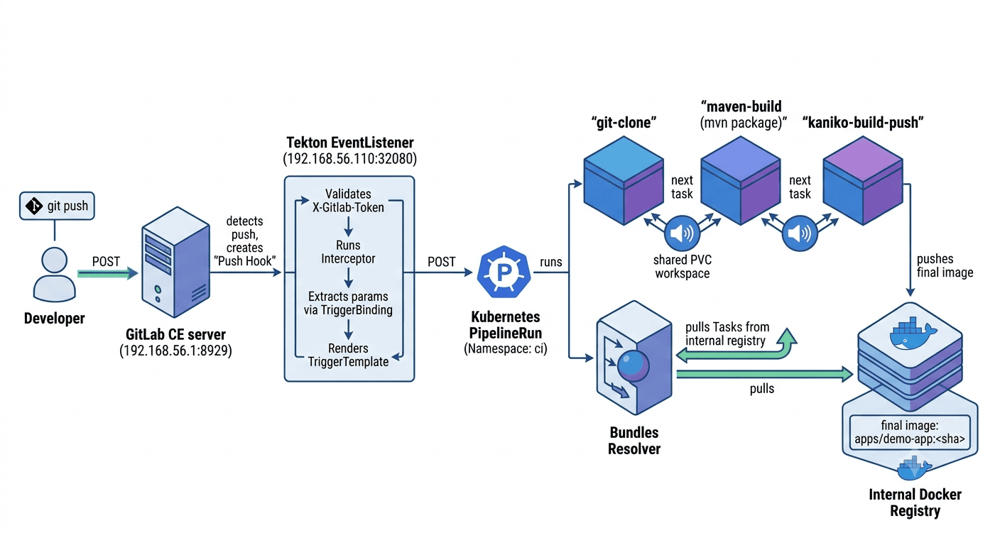
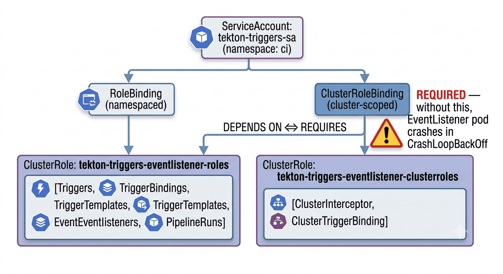

# Infraestrutura de CI/CD com Tekton em Cluster k3s

Guia de instalação e configuração da infraestrutura base: Tekton em cluster **k3s** local (1 server + 2 agents), **Task Bundles** em registry interno e webhook do **GitLab Community**.

> Para evolução multi-tenant, consulte [tekton-multitenant.md](tekton-multitenant.md).
> Para operação da plataforma, consulte [tekton-ci-playbook.md](tekton-ci-playbook.md).
> Para problemas conhecidos, consulte [troubleshooting.md](troubleshooting.md).

---

## Sumário

1. [Arquitetura e visão geral](#1-arquitetura-e-visão-geral)
2. [Fluxos e diagramas](#2-fluxos-e-diagramas)
3. [Pré-requisitos](#3-pré-requisitos)
4. [Fase 1 — Instalação do Tekton](#4-fase-1--instalação-do-tekton)
5. [Fase 2 — Registry interno no cluster](#5-fase-2--registry-interno-no-cluster)
6. [Fase 3 — Tasks e publicação como Task Bundles](#6-fase-3--tasks-e-publicação-como-task-bundles)
7. [Fase 4 — Pipeline consumindo os Bundles](#7-fase-4--pipeline-consumindo-os-bundles)
8. [Fase 5 — GitLab Community via Docker Compose](#8-fase-5--gitlab-community-via-docker-compose)
9. [Fase 6 — App Java de exemplo](#9-fase-6--app-java-de-exemplo)
10. [Fase 7 — Triggers e webhook do GitLab](#10-fase-7--triggers-e-webhook-do-gitlab)
11. [Fase 8 — Autenticação Git no clone](#11-fase-8--autenticação-git-no-clone)
12. [Fase 9 — Tekton Dashboard](#12-fase-9--tekton-dashboard)

---

## 1. Arquitetura e visão geral

O objetivo é montar uma pipeline de CI que:

1. Recebe um `Push Hook` do GitLab
2. É autenticada por um secret compartilhado (interceptor `gitlab` do Tekton Triggers)
3. Executa um Pipeline que faz **clone → build (Maven) → build+push da imagem (Kaniko)**
4. Publica a imagem final em um **registry Docker interno** do cluster
5. Todas as Tasks são referenciadas como **Task Bundles** (artefatos OCI armazenados no mesmo registry)

### Componentes

| Componente | Onde roda | Função |
|---|---|---|
| **Tekton Pipelines** | ns `tekton-pipelines` | Executa Tasks e Pipelines |
| **Tekton Triggers** | ns `tekton-pipelines` | Recebe eventos HTTP e cria PipelineRuns |
| **Interceptors** | ns `tekton-pipelines` | Valida assinatura do GitLab |
| **Tekton Dashboard** | ns `tekton-pipelines` | UI web para observabilidade |
| **Bundles Resolver** | ns `tekton-pipelines-resolvers` | Puxa Task Bundles do registry OCI |
| **Docker Registry v2** | ns `registry` | Guarda bundles + imagens finais |
| **GitLab CE** | Host (Docker Compose, `network_mode: host`) | SCM + emissor de webhooks |

---

## 2. Fluxos e diagramas

### Fluxo 1 — Topologia de rede




### Fluxo 2 — Sequência de instalação



### Fluxo 3 — Ciclo de vida do webhook até imagem no registry




### Fluxo 4 — RBAC do EventListener (armadilha do Triggers)




---

## 3. Pré-requisitos

- Cluster k3s (1 server + 2 agents) funcional
- `kubectl` configurado no server
- Acesso root/sudo nos 3 nós
- Docker + Docker Compose no host
- Rede entre host e VMs funcionando (rede libvirt)

Confirmar:

```bash
kubectl version
kubectl get nodes -o wide
```

Deve mostrar `Server Version: vX.Y.Z+k3s1` e três nós `Ready`.

---

## 4. Fase 1 — Instalação do Tekton

### 4.1. Instalar Pipelines

```bash
kubectl apply -f https://storage.googleapis.com/tekton-releases/pipeline/latest/release.yaml
```

**Importante:** aguarde o webhook antes de instalar Triggers.

```bash
kubectl -n tekton-pipelines wait --for=condition=Ready pod \
  -l app.kubernetes.io/name=webhook --timeout=180s
```

### 4.2. Instalar Triggers e Interceptors

```bash
kubectl apply -f https://storage.googleapis.com/tekton-releases/triggers/latest/release.yaml
kubectl apply -f https://storage.googleapis.com/tekton-releases/triggers/latest/interceptors.yaml
```

Se o primeiro apply falhar com `no endpoints available for service "tekton-pipelines-webhook"`, aguarde 30s e reaplique (é idempotente).

### 4.3. Instalar o Dashboard

```bash
kubectl apply -f https://storage.googleapis.com/tekton-releases/dashboard/latest/release.yaml
```

### 4.4. Habilitar o bundles resolver

```bash
kubectl -n tekton-pipelines patch cm feature-flags \
  --type merge -p '{"data":{"enable-bundles-resolver":"true"}}'

kubectl -n tekton-pipelines get cm feature-flags \
  -o jsonpath='{.data.enable-bundles-resolver}'
```

### 4.5. Validação

```bash
kubectl get pods -n tekton-pipelines
kubectl get pods -n tekton-pipelines-resolvers
kubectl get crds | grep tekton
kubectl get clusterinterceptors
```

Interceptors esperados: `gitlab`, `github`, `bitbucket`, `cel`, `slack`.

### 4.6. Smoke test do Pipelines

```bash
kubectl create ns tekton-test

cat <<'EOF' | kubectl apply -f -
apiVersion: tekton.dev/v1
kind: TaskRun
metadata:
  name: hello-world
  namespace: tekton-test
spec:
  taskSpec:
    steps:
    - name: say-hi
      image: alpine:3.19
      script: |
        #!/bin/sh
        echo "Tekton está funcionando!"
EOF

kubectl -n tekton-test get taskrun hello-world -w
```

### 4.7. Smoke test do Triggers (revela armadilha do RBAC)

```bash
cat <<'EOF' | kubectl apply -f -
apiVersion: v1
kind: ServiceAccount
metadata:
  name: test-sa
  namespace: tekton-test
---
apiVersion: rbac.authorization.k8s.io/v1
kind: RoleBinding
metadata:
  name: test-sa-eventlistener
  namespace: tekton-test
subjects:
- kind: ServiceAccount
  name: test-sa
roleRef:
  apiGroup: rbac.authorization.k8s.io
  kind: ClusterRole
  name: tekton-triggers-eventlistener-roles
---
apiVersion: rbac.authorization.k8s.io/v1
kind: ClusterRoleBinding
metadata:
  name: test-sa-eventlistener-cluster
subjects:
- kind: ServiceAccount
  name: test-sa
  namespace: tekton-test
roleRef:
  apiGroup: rbac.authorization.k8s.io
  kind: ClusterRole
  name: tekton-triggers-eventlistener-clusterroles
---
apiVersion: triggers.tekton.dev/v1beta1
kind: TriggerTemplate
metadata:
  name: test-tt
  namespace: tekton-test
spec:
  resourcetemplates:
  - apiVersion: tekton.dev/v1
    kind: TaskRun
    metadata:
      generateName: triggered-hello-
    spec:
      taskSpec:
        steps:
        - name: echo
          image: alpine:3.19
          script: echo "Disparado via webhook!"
---
apiVersion: triggers.tekton.dev/v1beta1
kind: EventListener
metadata:
  name: test-el
  namespace: tekton-test
spec:
  serviceAccountName: test-sa
  triggers:
  - template:
      ref: test-tt
EOF
```

Testar POST:

```bash
kubectl -n tekton-test run curl-test --rm -it --restart=Never \
  --image=curlimages/curl:latest -- \
  curl -X POST -H "Content-Type: application/json" -d '{}' \
  http://el-test-el.tekton-test.svc.cluster.local:8080
```

Resposta esperada: `{"eventListener":"test-el",...,"eventID":"..."}`.

### 4.8. Limpeza

```bash
kubectl delete ns tekton-test
kubectl delete clusterrolebinding test-sa-eventlistener-cluster
```

---

## 5. Fase 2 — Registry interno no cluster

### 5.1. Deploy do Docker Registry v2

`registry.yaml`:

```yaml
apiVersion: v1
kind: Namespace
metadata:
  name: registry
---
apiVersion: v1
kind: PersistentVolumeClaim
metadata:
  name: registry-data
  namespace: registry
spec:
  accessModes: ["ReadWriteOnce"]
  resources:
    requests:
      storage: 20Gi
---
apiVersion: apps/v1
kind: Deployment
metadata:
  name: registry
  namespace: registry
spec:
  replicas: 1
  selector:
    matchLabels: { app: registry }
  template:
    metadata:
      labels: { app: registry }
    spec:
      containers:
      - name: registry
        image: registry:2
        ports:
        - containerPort: 5000
        env:
        - name: REGISTRY_STORAGE_DELETE_ENABLED
          value: "true"
        - name: REGISTRY_HTTP_ADDR
          value: ":5000"
        volumeMounts:
        - name: data
          mountPath: /var/lib/registry
      volumes:
      - name: data
        persistentVolumeClaim:
          claimName: registry-data
---
apiVersion: v1
kind: Service
metadata:
  name: registry
  namespace: registry
spec:
  type: NodePort
  selector: { app: registry }
  ports:
  - port: 5000
    targetPort: 5000
    nodePort: 32000
```

```bash
kubectl apply -f registry.yaml
kubectl -n registry get pods -w
```

### 5.2. Validar

```bash
IP_SERVER=$(kubectl get node k3s-server -o jsonpath='{.status.addresses[?(@.type=="InternalIP")].address}')
curl http://$IP_SERVER:32000/v2/
```

Retorno esperado: `{}`.

### 5.3. Configurar k3s pra aceitar o registry inseguro

Em **cada um dos 3 nós**, criar `/etc/rancher/k3s/registries.yaml`:

```yaml
mirrors:
  "registry.registry.svc.cluster.local:5000":
    endpoint:
      - "http://registry.registry.svc.cluster.local:5000"
  "192.168.56.110:32000":
    endpoint:
      - "http://192.168.56.110:32000"
configs:
  "registry.registry.svc.cluster.local:5000":
    tls:
      insecure_skip_verify: true
  "192.168.56.110:32000":
    tls:
      insecure_skip_verify: true
```

Reiniciar o serviço em cada nó:

```bash
# No k3s-server
sudo systemctl restart k3s

# Nos agents
sudo systemctl restart k3s-agent
```

### 5.4. Instalar o `tkn` CLI no server

```bash
LATEST=$(curl -s https://api.github.com/repos/tektoncd/cli/releases/latest | grep tag_name | cut -d'"' -f4)
VERSION=${LATEST#v}
curl -LO "https://github.com/tektoncd/cli/releases/download/${LATEST}/tkn_${VERSION}_Linux_x86_64.tar.gz"
file tkn_${VERSION}_Linux_x86_64.tar.gz
sudo tar xvzf tkn_${VERSION}_Linux_x86_64.tar.gz -C /usr/local/bin/ tkn
tkn version
```

---

## 6. Fase 3 — Tasks e publicação como Task Bundles

### 6.1. O que é Task Bundle

Um artefato OCI (mesma tecnologia de imagem Docker) contendo o YAML da Task. Vantagens:

- **Versionamento imutável** via tags e digests
- **Reuso entre clusters** sem sincronizar CRDs
- **Consumo remoto** via `resolver: bundles`
- **Auditoria** — cada versão tem digest imutável

### 6.2. Preparar diretórios

```bash
kubectl create ns ci
mkdir -p ~/tekton-lab/tasks
cd ~/tekton-lab
```

### 6.3. Task: `git-clone`

`tasks/git-clone.yaml`:

```yaml
apiVersion: tekton.dev/v1
kind: Task
metadata:
  name: git-clone
spec:
  description: Clona um repositório Git no workspace.
  params:
  - name: url
    type: string
  - name: revision
    type: string
    default: main
  workspaces:
  - name: output
  results:
  - name: commit
  steps:
  - name: clone
    image: alpine/git:2.43.0
    script: |
      #!/bin/sh
      set -eu
      cd $(workspaces.output.path)
      git clone $(params.url) .
      git checkout $(params.revision)
      COMMIT=$(git rev-parse HEAD)
      printf "%s" "$COMMIT" > $(results.commit.path)
```

### 6.4. Task: `maven-build`

`tasks/maven-build.yaml`:

```yaml
apiVersion: tekton.dev/v1
kind: Task
metadata:
  name: maven-build
spec:
  description: Compila e empacota uma aplicação Java com Maven.
  params:
  - name: goals
    type: string
    default: "clean package -DskipTests"
  workspaces:
  - name: source
  steps:
  - name: build
    image: maven:3.9-eclipse-temurin-17
    workingDir: $(workspaces.source.path)
    script: |
      #!/bin/sh
      set -eu
      mvn $(params.goals)
      ls -lh target/*.jar 2>/dev/null || echo "Nenhum JAR encontrado"
```

### 6.5. Task: `kaniko-build-push`

`tasks/kaniko.yaml`:

```yaml
apiVersion: tekton.dev/v1
kind: Task
metadata:
  name: kaniko-build-push
spec:
  description: Constrói uma imagem com Kaniko e envia para o registry.
  params:
  - name: image
    type: string
  - name: dockerfile
    type: string
    default: Dockerfile
  - name: context
    type: string
    default: ./
  workspaces:
  - name: source
  results:
  - name: image-digest
  steps:
  - name: build-and-push
    image: gcr.io/kaniko-project/executor:v1.23.2
    args:
    - --dockerfile=$(params.dockerfile)
    - --context=$(workspaces.source.path)/$(params.context)
    - --destination=$(params.image)
    - --insecure
    - --skip-tls-verify
    - --insecure-pull
    - --skip-tls-verify-pull
    - --digest-file=$(results.image-digest.path)
```

### 6.6. Publicar

```bash
REG=192.168.56.110:32000

tkn bundle push $REG/tekton/git-clone:v1         -f tasks/git-clone.yaml
tkn bundle push $REG/tekton/maven-build:v1       -f tasks/maven-build.yaml
tkn bundle push $REG/tekton/kaniko-build-push:v1 -f tasks/kaniko.yaml
```

### 6.7. Validar

```bash
curl -s http://192.168.56.110:32000/v2/_catalog
curl -s http://192.168.56.110:32000/v2/tekton/git-clone/tags/list
```

---

## 7. Fase 4 — Pipeline consumindo os Bundles

`pipeline.yaml`:

```yaml
apiVersion: tekton.dev/v1
kind: Pipeline
metadata:
  name: java-app-pipeline
  namespace: ci
spec:
  params:
  - name: repo-url
    type: string
  - name: revision
    type: string
    default: main
  - name: image
    type: string
  workspaces:
  - name: shared
  tasks:
  - name: clone
    taskRef:
      resolver: bundles
      params:
      - name: bundle
        value: registry.registry.svc.cluster.local:5000/tekton/git-clone:v1
      - name: name
        value: git-clone
      - name: kind
        value: task
    params:
    - name: url
      value: $(params.repo-url)
    - name: revision
      value: $(params.revision)
    workspaces:
    - name: output
      workspace: shared

  - name: build
    runAfter: [clone]
    taskRef:
      resolver: bundles
      params:
      - name: bundle
        value: registry.registry.svc.cluster.local:5000/tekton/maven-build:v1
      - name: name
        value: maven-build
      - name: kind
        value: task
    workspaces:
    - name: source
      workspace: shared

  - name: image
    runAfter: [build]
    taskRef:
      resolver: bundles
      params:
      - name: bundle
        value: registry.registry.svc.cluster.local:5000/tekton/kaniko-build-push:v1
      - name: name
        value: kaniko-build-push
      - name: kind
        value: task
    params:
    - name: image
      value: $(params.image)
    workspaces:
    - name: source
      workspace: shared
```

```bash
kubectl apply -f pipeline.yaml
kubectl -n ci get pipeline
```

---

## 8. Fase 5 — GitLab Community via Docker Compose

### 8.1. Descobrir IP do host na rede das VMs

```bash
ip -4 addr show | grep 192.168
```

Identifique a interface que está na mesma sub-rede das VMs — normalmente `virbr1` com IP `192.168.56.1`.

### 8.2. Estrutura

```bash
mkdir -p ~/gitlab-lab/{config,logs,data}
cd ~/gitlab-lab
```

### 8.3. `docker-compose.yml` (com network_mode: host)

Este ponto foi **crítico**: sem `network_mode: host`, o container do GitLab (na rede Docker 172.18.0.0/16) não consegue rotear pra 192.168.56.0/24.

```yaml
services:
  gitlab:
    image: gitlab/gitlab-ce:latest
    container_name: gitlab
    restart: unless-stopped
    hostname: gitlab.local
    network_mode: host
    environment:
      GITLAB_OMNIBUS_CONFIG: |
        external_url 'http://192.168.56.1:8929'
        nginx['listen_port'] = 8929
        gitlab_rails['gitlab_shell_ssh_port'] = 2224
        puma['worker_processes'] = 2
        sidekiq['max_concurrency'] = 10
        prometheus_monitoring['enable'] = false
    volumes:
      - ./config:/etc/gitlab
      - ./logs:/var/log/gitlab
      - ./data:/var/opt/gitlab
    shm_size: 256m
```

### 8.4. Subir

```bash
docker compose up -d
docker compose logs -f gitlab
```

Aguarde `gitlab Reconfigured!` (3–8 minutos).

### 8.5. Senha inicial

```bash
docker exec gitlab cat /etc/gitlab/initial_root_password | grep Password:
```

Login: `root`. Trocar a senha ao entrar.

### 8.6. **CRÍTICO** — Liberar Outbound requests para redes locais

Por segurança, o GitLab bloqueia webhooks para redes privadas por default:

1. **Admin Area → Settings → Network → Outbound requests**
2. Marcar:
   - ☑ Allow requests to the local network from webhooks and integrations
   - ☑ Allow requests to the local network from system hooks
3. **Save changes**

Sem isso, o GitLab recusa a URL do webhook com "Invalid url given".

---

## 9. Fase 6 — App Java de exemplo

```bash
mkdir -p ~/java-app-demo/src/main/java/com/example
cd ~/java-app-demo
```

**`pom.xml`:**

```xml
<?xml version="1.0" encoding="UTF-8"?>
<project xmlns="http://maven.apache.org/POM/4.0.0">
    <modelVersion>4.0.0</modelVersion>
    <groupId>com.example</groupId>
    <artifactId>demo-app</artifactId>
    <version>1.0.0</version>
    <packaging>jar</packaging>
    <properties>
        <maven.compiler.source>17</maven.compiler.source>
        <maven.compiler.target>17</maven.compiler.target>
        <project.build.sourceEncoding>UTF-8</project.build.sourceEncoding>
    </properties>
    <build>
        <finalName>demo-app</finalName>
        <plugins>
            <plugin>
                <groupId>org.apache.maven.plugins</groupId>
                <artifactId>maven-jar-plugin</artifactId>
                <version>3.4.1</version>
                <configuration>
                    <archive>
                        <manifest>
                            <mainClass>com.example.App</mainClass>
                        </manifest>
                    </archive>
                </configuration>
            </plugin>
        </plugins>
    </build>
</project>
```

**`src/main/java/com/example/App.java`:**

```java
package com.example;

public class App {
    public static void main(String[] args) {
        System.out.println("Hello from Tekton pipeline!");
    }
}
```

**`Dockerfile`:**

```dockerfile
FROM eclipse-temurin:17-jre-alpine
WORKDIR /app
COPY target/demo-app.jar app.jar
ENTRYPOINT ["java", "-jar", "app.jar"]
```

**`.gitignore`:**

```
target/
*.class
.idea/
.vscode/
```

Enviar:

```bash
git init
git add .
git commit -m "Initial commit"
git remote add origin http://192.168.56.1:8929/root/java-app.git
git push -u origin main
```

---

## 10. Fase 7 — Triggers e webhook do GitLab

### 10.1. RBAC — precisa das DUAS bindings

```yaml
# triggers-rbac.yaml
apiVersion: v1
kind: ServiceAccount
metadata:
  name: tekton-triggers-sa
  namespace: ci
---
apiVersion: rbac.authorization.k8s.io/v1
kind: RoleBinding
metadata:
  name: tekton-triggers-eventlistener-binding
  namespace: ci
subjects:
- kind: ServiceAccount
  name: tekton-triggers-sa
  namespace: ci
roleRef:
  apiGroup: rbac.authorization.k8s.io
  kind: ClusterRole
  name: tekton-triggers-eventlistener-roles
---
apiVersion: rbac.authorization.k8s.io/v1
kind: ClusterRoleBinding
metadata:
  name: tekton-triggers-sa-cluster
subjects:
- kind: ServiceAccount
  name: tekton-triggers-sa
  namespace: ci
roleRef:
  apiGroup: rbac.authorization.k8s.io
  kind: ClusterRole
  name: tekton-triggers-eventlistener-clusterroles
```

```bash
kubectl apply -f triggers-rbac.yaml
```

### 10.2. Secret do webhook

```bash
kubectl -n ci create secret generic gitlab-webhook-secret \
  --from-literal=secretToken='UM_TOKEN_FORTE_ALEATORIO'
```

Guarde exatamente esse valor — vai colar na UI do GitLab.

### 10.3. TriggerBinding, TriggerTemplate, Trigger, EventListener

```yaml
# triggers.yaml
apiVersion: triggers.tekton.dev/v1beta1
kind: TriggerBinding
metadata:
  name: gitlab-push-binding
  namespace: ci
spec:
  params:
  - name: repo-url
    value: $(body.repository.git_http_url)
  - name: revision
    value: $(body.checkout_sha)
  - name: short-sha
    value: $(body.checkout_sha)
---
apiVersion: triggers.tekton.dev/v1beta1
kind: TriggerTemplate
metadata:
  name: java-app-template
  namespace: ci
spec:
  params:
  - name: repo-url
  - name: revision
  - name: short-sha
  resourcetemplates:
  - apiVersion: tekton.dev/v1
    kind: PipelineRun
    metadata:
      generateName: java-app-run-
    spec:
      pipelineRef:
        name: java-app-pipeline
      params:
      - name: repo-url
        value: $(tt.params.repo-url)
      - name: revision
        value: $(tt.params.revision)
      - name: image
        value: registry.registry.svc.cluster.local:5000/apps/demo-app:$(tt.params.short-sha)
      workspaces:
      - name: shared
        volumeClaimTemplate:
          spec:
            accessModes: ["ReadWriteOnce"]
            resources:
              requests:
                storage: 2Gi
---
apiVersion: triggers.tekton.dev/v1beta1
kind: Trigger
metadata:
  name: gitlab-push-trigger
  namespace: ci
spec:
  serviceAccountName: tekton-triggers-sa
  interceptors:
  - ref:
      name: "gitlab"
    params:
    - name: secretRef
      value:
        secretName: gitlab-webhook-secret
        secretKey: secretToken
    - name: eventTypes
      value: ["Push Hook"]
  bindings:
  - ref: gitlab-push-binding
  template:
    ref: java-app-template
---
apiVersion: triggers.tekton.dev/v1beta1
kind: EventListener
metadata:
  name: gitlab-listener
  namespace: ci
spec:
  serviceAccountName: tekton-triggers-sa
  triggers:
  - triggerRef: gitlab-push-trigger
---
apiVersion: v1
kind: Service
metadata:
  name: el-gitlab-listener-np
  namespace: ci
spec:
  type: NodePort
  selector:
    eventlistener: gitlab-listener
  ports:
  - port: 8080
    targetPort: 8080
    nodePort: 32080
```

```bash
kubectl apply -f triggers.yaml
kubectl -n ci get pods -l eventlistener=gitlab-listener -w
```

### 10.4. Cadastrar webhook no GitLab

Na UI do projeto, **Settings → Webhooks → Add new webhook**:

- **URL:** `http://192.168.56.110:32080`
- **Secret Token:** o mesmo valor do secret `gitlab-webhook-secret`
- **Trigger:** ✓ Push events
- **Enable SSL verification:** ☐ desmarcado

### 10.5. Testar

Na tela do webhook, botão **Test → Push events**. Resposta esperada: `HTTP 202`.

---

## 11. Fase 8 — Autenticação Git no clone

Se o projeto está **Private**, o `git clone` falha com `could not read Username`. Duas soluções:

### 11.1. Opção A — Projeto Public (lab)

**Settings → General → Visibility** → **Public** → **Save changes**

### 11.2. Opção B — PAT + Basic Auth (produção)

Gerar PAT no GitLab (**Preferences → Access tokens**, scope `read_repository`).

```bash
kubectl -n ci create secret generic gitlab-basic-auth \
  --type=kubernetes.io/basic-auth \
  --from-literal=username=root \
  --from-literal=password='<PAT>'

kubectl -n ci annotate secret gitlab-basic-auth \
  tekton.dev/git-0=http://192.168.56.1:8929

kubectl -n ci patch serviceaccount default \
  -p '{"secrets":[{"name":"gitlab-basic-auth"}]}'
```

A anotação `tekton.dev/git-0` diz ao Tekton "use esse secret quando clonar dessa URL". Sem ela, o secret existe mas não é aplicado.

---

## 12. Fase 9 — Tekton Dashboard

### Opção 1 — Port-forward rápido

```bash
kubectl -n tekton-pipelines port-forward --address 0.0.0.0 \
  svc/tekton-dashboard 9097:9097
```

Acesso: `http://192.168.56.110:9097`

### Opção 2 — NodePort permanente

```bash
cat <<'EOF' | kubectl apply -f -
apiVersion: v1
kind: Service
metadata:
  name: tekton-dashboard-np
  namespace: tekton-pipelines
spec:
  type: NodePort
  selector:
    app.kubernetes.io/name: dashboard
    app.kubernetes.io/part-of: tekton-dashboard
  ports:
  - port: 9097
    targetPort: 9097
    nodePort: 32097
EOF
```

Acesso: `http://192.168.56.110:32097`

O Dashboard mostra:
- **PipelineRuns** — histórico e status
- **TaskRuns** — cada task individual com logs
- **Pipelines** — definições
- **EventListeners** — status dos EL configurados
- Grafo visual de cada run com logs em tempo real
- Botão **Rerun** pra disparar novamente

---

## 13. Diagramas e troubleshooting

- Prompts para gerar diagramas: [gemini-prompts.md](gemini-prompts.md)
- Problemas conhecidos desta fase: [troubleshooting.md](troubleshooting.md)

---

## Referências

- [Tekton Pipelines](https://tekton.dev/docs/pipelines/)
- [Tekton Triggers](https://tekton.dev/docs/triggers/)
- [Tekton Bundles Resolver](https://tekton.dev/docs/pipelines/bundle-resolver/)
- [k3s registries.yaml](https://docs.k3s.io/installation/private-registry)
- [Kaniko](https://github.com/GoogleContainerTools/kaniko)
- [GitLab CE Docker](https://docs.gitlab.com/ee/install/docker.html)
- [GitLab Webhooks](https://docs.gitlab.com/ee/user/project/integrations/webhooks.html)

---

<!-- Os prompts Gemini foram movidos para gemini-prompts.md -->
<!-- O troubleshooting foi movido para troubleshooting.md -->
<!-- Conteúdo original preservado abaixo para referência -->

## Prompts para gerar diagramas com Gemini (legado)

Cole cada prompt no **Gemini** (versão com geração de imagem, como Gemini Advanced ou Nano Banana / Imagen). Todos escritos em inglês para melhor fidelidade da renderização.

### Prompt 1 — Diagrama de topologia de rede

```
Create a clean, professional technical infrastructure diagram showing the network 
topology of a local Kubernetes lab:

- A large outer rectangle labeled "Host Notebook (Linux)"
- Inside, three network interfaces listed as small text: 
  wlo1 (192.168.0.13), virbr0 (192.168.121.1), virbr1 (192.168.56.1 - highlighted)
- Inside the host, a smaller rectangle labeled "GitLab CE (Docker Compose, 
  network_mode: host, port 8929)"
- Below GitLab, a large rectangle labeled "k3s Cluster (VMs in libvirt network 
  192.168.56.0/24)" containing three server icons labeled:
  "k3s-server (192.168.56.110)", "k3s-agent-1", "k3s-agent-2"
- On the right side of the cluster rectangle, three service badges:
  "Registry NodePort 32000", "EventListener NodePort 32080", 
  "Dashboard NodePort 32097"
- An arrow labeled "webhook HTTP POST" from GitLab to EventListener

Style: modern flat design, blue and gray palette, isometric or 2D flat, 
technical documentation aesthetic, minimal shadows, clear labels in English, 
white background.
```

### Prompt 2 — Fluxograma da instalação (fases 1 a 9)

```
Create a vertical flowchart showing 9 sequential installation phases of a 
Tekton CI/CD pipeline setup:

Phase 1: Install Tekton (Pipelines + Triggers + Interceptors + Dashboard)
Phase 2: Deploy internal Docker Registry (NodePort 32000) and configure 
  registries.yaml on 3 k3s nodes
Phase 3: Create Task Bundles (git-clone, maven-build, kaniko-build-push) 
  and push to registry
Phase 4: Define Pipeline that references bundles via resolver
Phase 5: Deploy GitLab CE via Docker Compose with network_mode: host
Phase 6: Create Java app repository (pom.xml, App.java, Dockerfile)
Phase 7: Set up Triggers (RBAC, Secret, TriggerTemplate, EventListener, 
  Webhook in GitLab)
Phase 8: Configure Git authentication (PAT + basic-auth secret)
Phase 9: Access Tekton Dashboard for observability

Style: vertical flow, rounded rectangles connected by downward arrows, 
each phase numbered and color-coded by category (blue=install, green=config, 
orange=integration, purple=observability). Professional technical documentation 
style, English labels, white background, clean typography.
```

### Prompt 3 — Fluxo do webhook até imagem publicada

```
Create a horizontal end-to-end sequence diagram showing a CI/CD workflow:

Actors from left to right:
1. Developer (person icon) with label "git push"
2. GitLab CE server icon (192.168.56.1:8929) — detects push, creates 
   "Push Hook"
3. Tekton EventListener (192.168.56.110:32080) — validates X-Gitlab-Token, 
   runs interceptor, extracts params via TriggerBinding, renders TriggerTemplate
4. Kubernetes PipelineRun resource created in namespace "ci"
5. Bundles Resolver — pulls Tasks from internal registry
6. Three sequential Task boxes: 
   "git-clone" → "maven-build (mvn package)" → "kaniko-build-push"
7. Internal Docker Registry showing final image "apps/demo-app:<sha>"

Between the tasks, show a shared PVC workspace icon.
Arrows between components should have short labels (POST, creates, pulls, 
runs, pushes).

Style: modern isometric diagram, blue/purple/green palette, professional 
DevOps documentation aesthetic, English labels, white background.
```

### Prompt 4 — RBAC do EventListener

```
Create a hierarchical RBAC diagram for a Kubernetes Tekton Triggers 
EventListener showing the DOUBLE binding requirement:

- Top: single ServiceAccount box labeled "tekton-triggers-sa (namespace: ci)"
- Two branches going down:
  Left branch: RoleBinding (namespaced) → ClusterRole 
    "tekton-triggers-eventlistener-roles" 
    with permissions listed: Triggers, TriggerBindings, TriggerTemplates, 
    EventListeners, PipelineRuns
  Right branch: ClusterRoleBinding (cluster-scoped) → ClusterRole 
    "tekton-triggers-eventlistener-clusterroles" 
    with permissions listed: ClusterInterceptor, ClusterTriggerBinding
- Add a warning label on the right branch: 
  "REQUIRED — without this, EventListener pod crashes in CrashLoopBackOff"

Style: clean hierarchical diagram, boxes and arrows, warning symbol on 
the critical branch (yellow/red), professional technical documentation, 
English labels, white background.
```

### Prompt 5 — Componentes do Tekton em execução

```
Create a Kubernetes cluster architecture diagram showing all Tekton components 
running in a k3s cluster:

- Outer rectangle "k3s Cluster" containing multiple namespaces as inner boxes:

  Namespace "tekton-pipelines":
    - Tekton Pipelines Controller pod
    - Tekton Pipelines Webhook pod
    - Tekton Triggers Controller pod
    - Tekton Triggers Webhook pod
    - Tekton Core Interceptors pod
    - Tekton Dashboard pod

  Namespace "tekton-pipelines-resolvers":
    - Bundles Resolver pod
    - Git Resolver pod

  Namespace "registry":
    - Docker Registry v2 pod + PVC 20Gi

  Namespace "ci":
    - EventListener pod (gitlab-listener)
    - Pipeline (java-app-pipeline)
    - Trigger, TriggerTemplate, TriggerBinding resources
    - Secret gitlab-webhook-secret
    - Secret gitlab-basic-auth
    - Multiple PipelineRun pods

- Arrows connecting components: EventListener → Triggers Controller → 
  PipelineRun; Bundles Resolver → Registry

Style: Kubernetes-themed diagram, blue and white palette, containers/pods 
as small boxes, namespaces as distinct-colored regions, English labels, 
professional cloud-native documentation aesthetic, white background.
```

### Prompt 6 — Diagrama simplificado (apresentação executiva)

```
Create a simple, elegant high-level architecture diagram for a technical 
presentation showing an internal CI/CD platform:

Left side: "Developer" icon with arrow pointing right, labeled "git push"

Center: three stacked layers:
  Top: "GitLab CE" (source control)
  Middle: "Tekton on Kubernetes" (CI/CD orchestration)
  Bottom: "Internal Registry" (artifact storage)

Right side: arrow going out labeled "Container image ready for deployment"

Add a small side panel labeled "Reusable Task Bundles" pointing into the 
Tekton layer.

Style: minimalist, corporate presentation aesthetic, gradient background, 
smooth rounded boxes, subtle icons, professional font, English labels, 
suitable for a slide deck.
```

---

## 14. Troubleshooting

Todos os problemas enfrentados durante esta montagem, em ordem cronológica com sintoma, causa e solução.

### 14.1. Race condition entre Pipelines e Triggers

**Sintoma:**
```
Error from server (InternalError): failed calling webhook 
"config.webhook.pipeline.tekton.dev": ... no endpoints available 
for service "tekton-pipelines-webhook"
```

**Causa:** o `apply` do Triggers começou antes do webhook do Pipelines subir completamente.

**Solução:**
```bash
kubectl -n tekton-pipelines wait --for=condition=Ready pod \
  -l app.kubernetes.io/name=webhook --timeout=180s

# Reaplicar Triggers (idempotente)
kubectl apply -f https://storage.googleapis.com/tekton-releases/triggers/latest/release.yaml
```

### 14.2. EventListener em CrashLoopBackOff

**Sintoma:** pod `el-<listener>-xxx` fica reiniciando, log mostra:
```
clusterinterceptors.triggers.tekton.dev is forbidden: 
User "system:serviceaccount:...:test-sa" cannot list resource 
"clusterinterceptors" in API group "triggers.tekton.dev" at the cluster scope
```

**Causa:** falta o `ClusterRoleBinding`. O EL precisa de **duas** bindings — namespaced e cluster-scoped.

**Solução:**
```bash
cat <<'EOF' | kubectl apply -f -
apiVersion: rbac.authorization.k8s.io/v1
kind: ClusterRoleBinding
metadata:
  name: <sa-name>-cluster
subjects:
- kind: ServiceAccount
  name: <sa-name>
  namespace: <namespace>
roleRef:
  apiGroup: rbac.authorization.k8s.io
  kind: ClusterRole
  name: tekton-triggers-eventlistener-clusterroles
EOF

kubectl -n <namespace> delete pod -l eventlistener=<listener>
```

### 14.3. `tkn` — download quebrado

**Sintoma:**
```
gzip: stdin: not in gzip format
tar: Error is not recoverable: exiting now
```

**Causa:** URL `latest/download/` retornou HTML de redirect em vez do binário.

**Solução:** usar URL versionada explícita:
```bash
LATEST=$(curl -s https://api.github.com/repos/tektoncd/cli/releases/latest | grep tag_name | cut -d'"' -f4)
VERSION=${LATEST#v}
curl -LO "https://github.com/tektoncd/cli/releases/download/${LATEST}/tkn_${VERSION}_Linux_x86_64.tar.gz"
file tkn_${VERSION}_Linux_x86_64.tar.gz
```

### 14.4. `tkn bundle push` — arquivo inexistente

**Sintoma:**
```
Error: failed to find and read file tasks/git-clone.yaml: 
open tasks/git-clone.yaml: no such file or directory
```

**Causa:** os arquivos YAML das Tasks não foram criados antes do push (só se rodou `mkdir`).

**Solução:** criar os arquivos primeiro com `cat > tasks/xxx.yaml <<'EOF' ... EOF`, depois publicar.

### 14.5. GitLab: "Invalid url given"

**Sintoma:** ao salvar webhook com URL `http://192.168.56.110:32080`, o GitLab recusa.

**Causa:** proteção SSRF do GitLab bloqueia webhooks para redes locais/privadas por default.

**Solução:** liberar na Admin Area:
- **Admin → Settings → Network → Outbound requests**
- Marcar "Allow requests to the local network from webhooks and integrations"
- Save changes

### 14.6. Webhook: "Connection refused"

**Sintoma:**
```
Hook execution failed: Failed to open TCP connection to 192.168.56.110:32080 
(Connection refused - connect(2))
```

**Diagnóstico:** o container do GitLab (na rede Docker `172.18.0.0/16`) não consegue rotear pra `192.168.56.0/24`. Confirmar com:

```bash
docker exec gitlab curl -v http://192.168.56.110:32080
```

**Solução:** trocar pra `network_mode: host` no `docker-compose.yml`:

```yaml
services:
  gitlab:
    ...
    network_mode: host       # ADICIONAR
    # ports:                 # REMOVER (incompatível com host mode)
    environment:
      GITLAB_OMNIBUS_CONFIG: |
        external_url 'http://192.168.56.1:8929'
        nginx['listen_port'] = 8929   # NECESSÁRIO — sem ports, define a escuta
        ...
```

Recriar:
```bash
docker compose down
docker compose up -d
```

### 14.7. Webhook retorna 202 mas nenhum PipelineRun aparece

**Sintoma:** GitLab mostra "Hook executed successfully: HTTP 202" e `kubectl -n ci get pipelinerun` continua vazio.

**Diagnóstico:** provavelmente o token do webhook não bate com o secret do cluster (interceptor `gitlab` rejeita silenciosamente).

**Solução — verificação em tempo real:**

Terminal 1:
```bash
kubectl -n ci logs -l eventlistener=gitlab-listener -f --timestamps
```

Terminal 2 — simular um POST com token real e body válido:
```bash
TOKEN=$(kubectl -n ci get secret gitlab-webhook-secret -o jsonpath='{.data.secretToken}' | base64 -d)
kubectl -n ci run curl-sim --rm -i --restart=Never --image=curlimages/curl:latest -- \
  curl -v -X POST \
  -H "Content-Type: application/json" \
  -H "X-Gitlab-Event: Push Hook" \
  -H "X-Gitlab-Token: $TOKEN" \
  -d '{"object_kind":"push","checkout_sha":"<SHA_REAL>","repository":{"git_http_url":"http://192.168.56.1:8929/root/java-app.git"}}' \
  http://el-gitlab-listener.ci.svc.cluster.local:8080
```

Se este teste criar o PipelineRun, o problema é apenas o token divergindo. Recopie o valor do secret pra dentro do webhook do GitLab e clique **Save changes**.

### 14.8. git-clone falha com "could not read Username"

**Sintoma no log da task:**
```
fatal: could not read Username for 'http://192.168.56.1:8929': 
No such device or address
```

**Causa:** projeto no GitLab é **Private** e não há credenciais anexadas ao Pipeline.

**Solução A (lab):** mudar projeto para **Public** em **Settings → General → Visibility**.

**Solução B (produção):** criar PAT + secret + anotação + anexar à SA:

```bash
kubectl -n ci create secret generic gitlab-basic-auth \
  --type=kubernetes.io/basic-auth \
  --from-literal=username=root \
  --from-literal=password='<PAT>'

kubectl -n ci annotate secret gitlab-basic-auth \
  tekton.dev/git-0=http://192.168.56.1:8929

kubectl -n ci patch serviceaccount default \
  -p '{"secrets":[{"name":"gitlab-basic-auth"}]}'
```

### 14.9. Registry Docker rejeitado ("HTTP response to HTTPS client")

**Sintoma:** pod não puxa imagem do registry interno, containerd loga `http: server gave HTTP response to HTTPS client`.

**Causa:** `/etc/rancher/k3s/registries.yaml` não configurado no nó, ou k3s não foi reiniciado depois.

**Solução:** verificar arquivo em cada nó e restart:
```bash
ls -la /etc/rancher/k3s/registries.yaml
sudo systemctl restart k3s        # no server
sudo systemctl restart k3s-agent  # nos agents
```

### 14.10. Kaniko falha empurrando pro registry

**Sintoma:** kaniko sai com erro tipo `x509: certificate signed by unknown authority` ou `http response to HTTPS client`.

**Causa:** flags de registro inseguro faltando.

**Solução:** confirmar que a Task `kaniko-build-push` tem TODOS estes flags:
```yaml
- --insecure
- --skip-tls-verify
- --insecure-pull
- --skip-tls-verify-pull
```

### 14.11. Namespace preso em "Terminating"

**Sintoma:** ao deletar um namespace, ele fica em `Terminating` por muito tempo e novos recursos falham com:
```
unable to create new content in namespace X because it is being terminated
```

**Causa:** algum recurso com finalizer travado (comum quando o EL foi deletado antes do namespace).

**Solução:** listar recursos com finalizers e remover:
```bash
kubectl get all -n <ns>
kubectl -n <ns> patch <resource>/<name> --type merge -p '{"metadata":{"finalizers":[]}}'
```

### 14.12. PipelineRun falha imediatamente com SHA inexistente

**Sintoma:** log da task `git-clone`:
```
fatal: pathspec 'abc1234' did not match any file(s) known to git
```

**Causa:** durante testes manuais foi passado um SHA fictício.

**Solução:** usar SHA real do repo. Em push events reais o `body.checkout_sha` sempre está correto.

### 14.13. Pods não conseguem resolver DNS interno do registry

**Sintoma:** pod puxa imagem via IP:NodePort funciona, mas falha via DNS `registry.registry.svc.cluster.local`.

**Diagnóstico rápido:**
```bash
kubectl run test --rm -it --restart=Never --image=curlimages/curl -- \
  curl http://registry.registry.svc.cluster.local:5000/v2/_catalog
```

**Causa comum:** entrada do DNS não está no `registries.yaml`. Precisa ter **as duas** entradas (DNS interno + IP:NodePort).

---

## Referências

- [Tekton Pipelines](https://tekton.dev/docs/pipelines/)
- [Tekton Triggers](https://tekton.dev/docs/triggers/)
- [Tekton Bundles Resolver](https://tekton.dev/docs/pipelines/bundle-resolver/)
- [k3s registries.yaml](https://docs.k3s.io/installation/private-registry)
- [Kaniko](https://github.com/GoogleContainerTools/kaniko)
- [GitLab CE Docker](https://docs.gitlab.com/ee/install/docker.html)
- [GitLab Webhooks](https://docs.gitlab.com/ee/user/project/integrations/webhooks.html)
